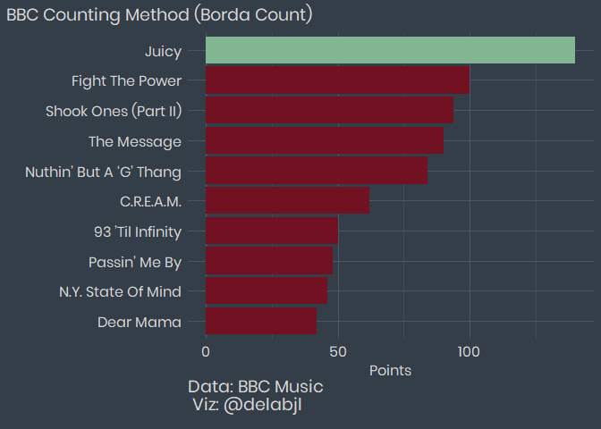
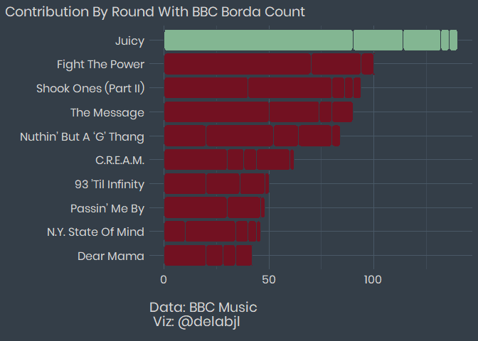
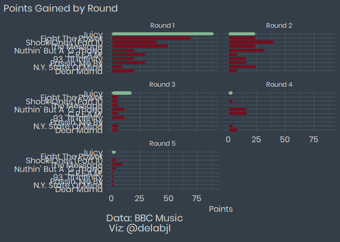
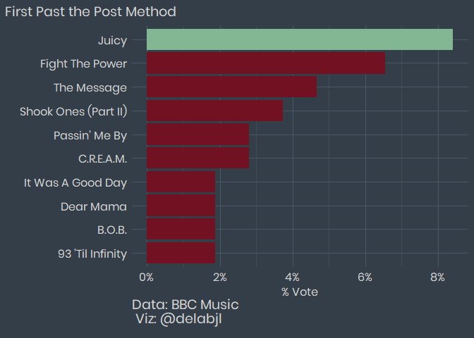

BBC Rap Poll
================
Joshua de la Bruere
4/14/2020

## Fetching the data/setup

As always I begin by fetching the data from the tidytuesday repo.
Considering the topic today, I am also considering using {spotifyR} to
get some more data on the songs.

### Packages:

These are the package I plan on using today:

  - tidyverse (It’s what this is all about)
  - spotifyr (Extra data from spotify’s API)
  - ggtext (A wonderful package by
    \[@ClausWilke\](<https://twitter.com/ClausWilke>) that enables
    better control over text rendering)
  - patchwork (By the amazing
    \[@thomasp85\](<https://twitter.com/thomasp85>) allows for easy
    combining of plots)
  - janitor (makes it easy to clean the names of a data set.)
  - forcats (easy work with factors)
  - delabj (A personal package that includes a few tweeks to ggplot, and
    custom themes)

<!-- end list -->

``` r
library(tidyverse)
library(spotifyr)
library(ggtext)
library(patchwork)
library(janitor)
library(delabj)
library(forcats)
library(ggchicklet)

polls <- readr::read_csv('https://raw.githubusercontent.com/rfordatascience/tidytuesday/master/data/2020/2020-04-14/polls.csv')
rankings <- readr::read_csv('https://raw.githubusercontent.com/rfordatascience/tidytuesday/master/data/2020/2020-04-14/rankings.csv')
```

let’s take a look at the data

``` r
polls
```

    ## # A tibble: 535 x 9
    ##     rank title artist gender  year critic_name critic_rols critic_country
    ##    <dbl> <chr> <chr>  <chr>  <dbl> <chr>       <chr>       <chr>         
    ##  1     1 Term~ Publi~ male    1998 Joseph Aba~ Fat Beats   US            
    ##  2     2 4th ~ Gza f~ male    1995 Joseph Aba~ Fat Beats   US            
    ##  3     3 Pete~ Run D~ male    1986 Joseph Aba~ Fat Beats   US            
    ##  4     4 Play~ GLOBE~ male    2001 Joseph Aba~ Fat Beats   US            
    ##  5     5 Time~ O.C.   male    1994 Joseph Aba~ Fat Beats   US            
    ##  6     1 Play~ Slum ~ male    1997 Biba Adams  Critic      US            
    ##  7     2 Self~ Stop ~ mixed   1989 Biba Adams  Critic      US            
    ##  8     3 Push~ Salt-~ female  1986 Biba Adams  Critic      US            
    ##  9     4 Ambi~ 2Pac   male    1996 Biba Adams  Critic      US            
    ## 10     5 Big ~ JAY-Z~ male    1999 Biba Adams  Critic      US            
    ## # ... with 525 more rows, and 1 more variable: critic_country2 <chr>

``` r
rankings
```

    ## # A tibble: 311 x 12
    ##       ID title   artist   year gender points     n    n1    n2    n3    n4    n5
    ##    <dbl> <chr>   <chr>   <dbl> <chr>   <dbl> <dbl> <dbl> <dbl> <dbl> <dbl> <dbl>
    ##  1     1 Juicy   The No~  1994 male      140    18     9     3     3     1     2
    ##  2     2 Fight ~ Public~  1989 male      100    11     7     3     1     0     0
    ##  3     3 Shook ~ Mobb D~  1995 male       94    13     4     5     1     1     2
    ##  4     4 The Me~ Grandm~  1982 male       90    14     5     3     1     0     5
    ##  5     5 Nuthin~ Dr Dre~  1992 male       84    14     2     4     2     4     2
    ##  6     6 C.R.E.~ Wu-Tan~  1993 male       62    10     3     1     1     4     1
    ##  7     7 93 ’Ti~ Souls ~  1993 male       50     7     2     2     2     0     1
    ##  8     8 Passin~ The Ph~  1992 male       48     6     3     2     0     0     1
    ##  9     9 N.Y. S~ Nas      1994 male       46     7     1     3     1     1     1
    ## 10    10 Dear M~ 2Pac     1995 male       42     6     2     1     1     2     0
    ## # ... with 301 more rows

I see that the way this poll was calculated, used a multi choise method,
which means there could be an interesting exploration of different
counting methods. I want to take a look to see if this is a viable
option.

``` r
polls %>%
  arrange(critic_name)
```

    ## # A tibble: 535 x 9
    ##     rank title artist gender  year critic_name critic_rols critic_country
    ##    <dbl> <chr> <chr>  <chr>  <dbl> <chr>       <chr>       <chr>         
    ##  1     1 Dear~ 2Pac   male    1995 Al Rocco    Artist      China         
    ##  2     2 Chan~ 2Pac ~ male    1998 Al Rocco    Artist      China         
    ##  3     3 Wu-T~ Wu-Ta~ male    1993 Al Rocco    Artist      China         
    ##  4     4 Shoo~ Mobb ~ male    1995 Al Rocco    Artist      China         
    ##  5     5 Juicy The N~ male    1994 Al Rocco    Artist      China         
    ##  6     1 Paid~ Eric ~ male    1987 Alejandro ~ Radio Pers~ Colombia      
    ##  7     2 N.Y.~ Nas    male    1994 Alejandro ~ Radio Pers~ Colombia      
    ##  8     3 Nuth~ Dr Dr~ male    1992 Alejandro ~ Radio Pers~ Colombia      
    ##  9     4 Ms J~ OutKa~ male    2000 Alejandro ~ Radio Pers~ Colombia      
    ## 10     5 All ~ Kanye~ mixed   2004 Alejandro ~ Radio Pers~ Colombia      
    ## # ... with 525 more rows, and 1 more variable: critic_country2 <chr>

I’m pretty sure that something can be done with borda count and first
past the post. I don’t have all pairwise comparisions, so I can’t do
condorcet comparisions without making a few assumptions.

``` r
bc <- rankings %>%
  arrange(desc(points)) %>%
  head(10) %>%
  mutate(title = as.factor(title)) %>%
  mutate(title =  fct_reorder(title, points)) %>%
  mutate(winner = if_else(points == max(rankings$points), "Winner", "Loser")) %>%
  ggplot(aes(x=points, y=title, fill = winner))+
  geom_bar(stat="identity")+
  labs(y="", x="Points", 
       title = "BBC Counting Method (Borda Count)", 
       caption = "Data: BBC Music\n Viz: @delabjl")+
  theme_delabj_dark()+
  scale_fill_delabj()+
  legend_none()

ggsave("bc.png", plot = bc, dpi=320, type = "cairo")
```

    ## Saving 7 x 5 in image

``` r
bc
```

<!-- -->

How this is calclualted

``` r
combo_bc <- rankings %>%
  arrange(desc(points)) %>%
  head(10) %>%
  mutate(title = as.factor(title)) %>%
  mutate(title =  fct_reorder(title, points)) %>%
  mutate(winner = if_else(points == max(rankings$points), "Winner", "Loser")) %>%
  pivot_longer(cols =  c('n1','n2','n3','n4','n5'),names_to = 'round') %>%
  mutate(points_by_round = case_when(
    round == "n1" ~ value * 10,
    round == "n2" ~ value * 8, 
    round == "n3" ~ value * 6,
    round == "n4" ~ value * 4,
    round == "n5" ~ value * 2,
    TRUE ~ 0
  )) %>%
  ggplot(aes(y=points_by_round, x=title, fill = winner, group = round))+
  geom_chicklet( color  = "#343E48")+
  coord_flip()+
   labs(y="", x="", 
       title = "Contribution By Round With BBC Borda Count", 
       caption = "Data: BBC Music\n Viz: @delabjl")+
  theme_delabj_dark()+
  scale_fill_delabj()+
  legend_none()


supp.labs <- c("Round 1","Round 2", "Round 3", "Round 4", "Round 5")
names(supp.labs) <- c("n1", "n2", "n3", "n4", "n5")


by_round_bc <- rankings %>%
  arrange(desc(points)) %>%
  head(10) %>%
  mutate(title = as.factor(title)) %>%
  mutate(title =  fct_reorder(title, points)) %>%
  mutate(winner = if_else(points == max(rankings$points), "Winner", "Loser")) %>%
  pivot_longer(cols =  c('n1','n2','n3','n4','n5'),names_to = 'round') %>%
  mutate(points_by_round = case_when(
    round == "n1" ~ value * 10,
    round == "n2" ~ value * 8, 
    round == "n3" ~ value * 6,
    round == "n4" ~ value * 4,
    round == "n5" ~ value * 2,
    TRUE ~ 0
  )) %>%
  ggplot(aes(y=points_by_round, x=title, fill = winner, group = round))+
  geom_chicklet( color  = "#343E48")+
  coord_flip()+
   labs(y="Points", x="", 
       title = "Points Gained by Round",
       sub= "Using the Borda Count Method",
       caption = "Data: BBC Music\n Viz: @delabjl")+
  theme_delabj_dark()+
  scale_fill_delabj()+
  legend_none()+
  facet_wrap(~round, ncol = 2, labeller = labeller(round = supp.labs))+
  theme(strip.text = element_text(colour = "#D6D6D6"))

ggsave("combo_borda.png", plot = combo_bc, dpi=320, type = "cairo")
```

    ## Saving 7 x 5 in image

``` r
ggsave("by_round_borda.png", plot = by_round_bc, dpi=320, type = "cairo")
```

    ## Saving 7 x 5 in image

``` r
combo_bc
```

<!-- -->

``` r
by_round_bc
```

<!-- -->

Raw Votes

``` r
rc_chart <- rankings %>%
  arrange(desc(points)) %>%
  head(10) %>%
  mutate(title = as.factor(title)) %>%
  mutate(title =  fct_reorder(title, n)) %>%
  mutate(winner = if_else(n == max(n), "Winner", "Loser")) %>%
  ggplot(aes(x=n, y=title, fill = winner))+
  geom_bar(stat="identity")+
  labs(y="", x="Number of Votes All Rounds", 
       title = "Equal Point Ranked Voting", 
       caption = "Data: BBC Music\n Viz: @delabjl")+
  theme_delabj_dark()+
  scale_fill_delabj()+
  legend_none()

ggsave("rc.png", plot = rc_chart, dpi=320, type = "cairo")
```

    ## Saving 7 x 5 in image

``` r
rc_chart
```

<!-- -->

``` r
fpp <- polls %>%
  arrange(critic_name) %>%
  filter(rank == 1) %>%
  group_by(title, artist, gender) %>%
  summarise(votes = sum(rank), 
            percent_vote = sum(rank)/107)
fpp_chart <- fpp %>% arrange(desc(votes)) %>%
  head(10) %>%
  ungroup() %>%
  mutate(title = as.factor(title)) %>%
  mutate(title =  fct_reorder(title, percent_vote)) %>%
  mutate(winner = if_else(votes == max(fpp$votes), "Winner", "Loser")) %>%
  ggplot(aes(y=title, x = percent_vote, fill= winner))+
  geom_bar(stat = "identity")+
  labs(y="", x="% Vote", 
       title = "First Past the Post Method",
       caption = "Data: BBC Music\n Viz: @delabjl")+
  scale_x_continuous(labels = scales::percent_format(accuracy = 1))+
  theme_delabj_dark()+
  scale_fill_delabj()+
  legend_none()

ggsave("fpp.png", plot = fpp_chart, dpi=320, type = "cairo")
```

    ## Saving 7 x 5 in image

``` r
fpp_chart
```

<!-- -->
