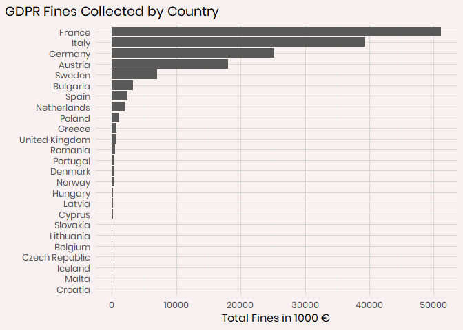
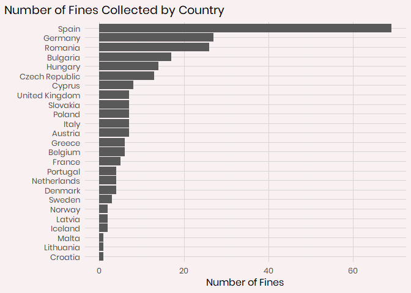
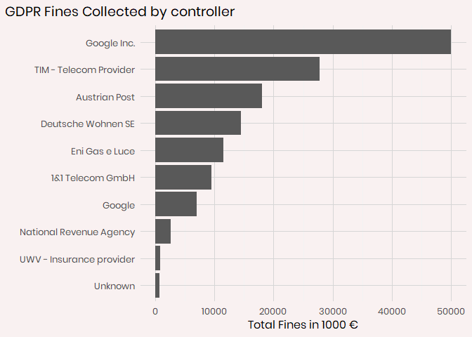
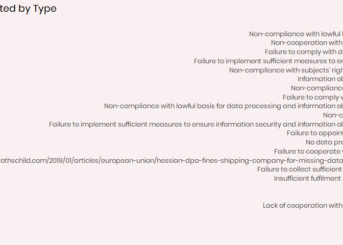
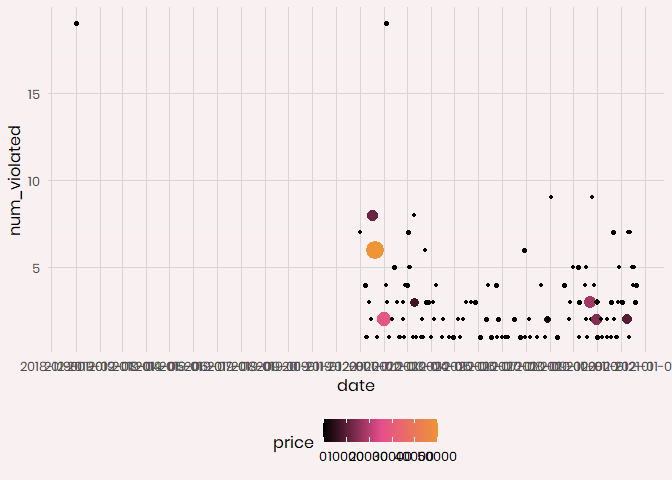
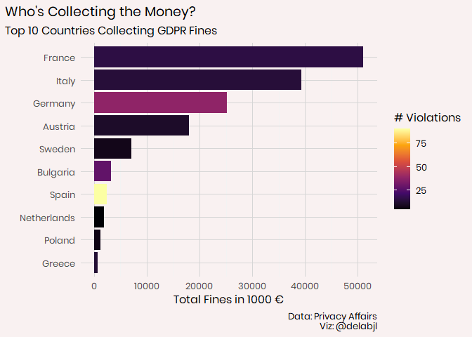
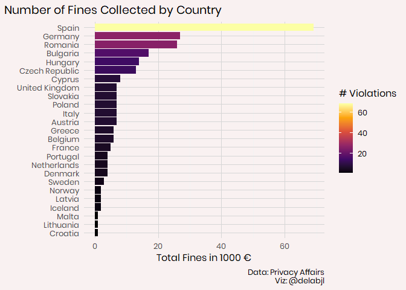

\#TidyTuesday: GDPR Fines
================

## Fetching the data/setup

As always I begin by fetching the data from the tidytuesday repo.

### Packages:

These are the package I plan on using today:

  - tidyverse (It’s what this is all about)
  - ggtext (A wonderful package by
    \[@ClausWilke\](<https://twitter.com/ClausWilke>) that enables
    better control over text rendering)
  - patchwork (By the amazing
    \[@thomasp85\](<https://twitter.com/thomasp85>) allows for easy
    combining of plots)
  - janitor (makes it easy to clean the names of a data set.)
  - forcats (easy work with factors)

<!-- end list -->

``` r
library(tidyverse)
library(ggtext)
library(patchwork)
```

    ## Warning: package 'patchwork' was built under R version 3.6.2

``` r
library(janitor)
```

    ## Warning: package 'janitor' was built under R version 3.6.2

``` r
library(forcats)
library(delabj)
library(glue)


gdpr_violations <- readr::read_tsv('https://raw.githubusercontent.com/rfordatascience/tidytuesday/master/data/2020/2020-04-21/gdpr_violations.tsv')
gdpr_text <- readr::read_tsv('https://raw.githubusercontent.com/rfordatascience/tidytuesday/master/data/2020/2020-04-21/gdpr_text.tsv')
```

## Examining The Data

Now looking at the data frame `gdpr_text`, I’m not likely to make use of
that today, at least for general analysis. Instead I want to gocus on
the violations recorded.

    ## # A tibble: 250 x 11
    ##       id picture name   price authority date  controller article_violated type 
    ##    <dbl> <chr>   <chr>  <dbl> <chr>     <chr> <chr>      <chr>            <chr>
    ##  1     1 https:~ Pola~   9380 Polish N~ 10/1~ Polish Ma~ Art. 28 GDPR     Non-~
    ##  2     2 https:~ Roma~   2500 Romanian~ 10/1~ UTTIS IND~ Art. 12 GDPR|Ar~ Info~
    ##  3     3 https:~ Spain  60000 Spanish ~ 10/1~ Xfera Mov~ Art. 5 GDPR|Art~ Non-~
    ##  4     4 https:~ Spain   8000 Spanish ~ 10/1~ Iberdrola~ Art. 31 GDPR     Fail~
    ##  5     5 https:~ Roma~ 150000 Romanian~ 10/0~ Raiffeise~ Art. 32 GDPR     Fail~
    ##  6     6 https:~ Roma~  20000 Romanian~ 10/0~ Vreau Cre~ Art. 32 GDPR|Ar~ Fail~
    ##  7     7 https:~ Gree~ 200000 Hellenic~ 10/0~ Telecommu~ Art. 5 (1) c) G~ Fail~
    ##  8     8 https:~ Gree~ 200000 Hellenic~ 10/0~ Telecommu~ Art. 21 (3) GDP~ Fail~
    ##  9     9 https:~ Spain  30000 Spanish ~ 10/0~ Vueling A~ Art. 5 GDPR|Art~ Non-~
    ## 10    10 https:~ Roma~   9000 Romanian~ 09/2~ Inteligo ~ Art. 5 (1) a) G~ Non-~
    ## # ... with 240 more rows, and 2 more variables: source <chr>, summary <chr>

There’s only 11 variables here and I’m looking at the options and I see
there’s only a handful of nice data to plot with. There’s country name,
price, date, controller, and type.

The article violated looks like it could use some cleaning up, and the
country flag is useful, for addding to a plot, but nothing to analyze
there. Summary would take some text mining to do anything with that.

I want to take a look at a summary plot of fine amount by type and
country.

``` r
gdpr_violations %>%
  group_by(name) %>%
  summarise(total_fines =  sum(price)/1000)%>%
  ggplot(aes(x = total_fines, y = fct_reorder(as.factor(name), total_fines)))+
  geom_bar(stat="identity")+
  theme_delabj()+
  labs(title = "GDPR Fines Collected by Country", 
       y = "",
       x = "Total Fines in 1000 €")
```

<!-- -->

``` r
gdpr_violations %>%
  group_by(name) %>%
  count() %>%
  ggplot(aes(x = n, y = fct_reorder(as.factor(name), n)))+
  geom_bar(stat="identity")+
  theme_delabj()+
  labs(title = "Number of Fines Collected by Country", 
       y = "",
       x = "Number of Fines")
```

<!-- -->

``` r
gdpr_violations %>%
  group_by(controller) %>%
  summarise(total_fines =  sum(price)/1000)%>%
    arrange(desc(total_fines)) %>%
  head(10) %>%
  ggplot(aes(x = total_fines, y = fct_reorder(as.factor(controller), total_fines)))+
  geom_bar(stat="identity")+
  theme_delabj() +
  labs(title = "GDPR Fines Collected by controller", 
      y="",
       x = "Total Fines in 1000 €")
```

<!-- -->

``` r
gdpr_violations %>%
  group_by(type) %>%
  summarise(total_fines =  sum(price)/1000)%>%

  ggplot(aes(x = total_fines, y = fct_reorder(as.factor(type), total_fines)))+
  geom_bar(stat="identity")+
  theme_delabj() +
  labs(title = "GDPR Fines Collected by Type", 
      y="",
       x = "Total Fines in 1000 €")
```

<!-- -->

It looks like the type of offence has a few more categories than I
expected. I probably should have checked that as a factor before
plotting

## Cleaning The Articles

The articles violated seemed like an interesting place to investigate as
well as being easier to clean.

``` r
gdpr_text %>% group_by(
  article
) %>%
  count()
```

    ## # A tibble: 99 x 2
    ## # Groups:   article [99]
    ##    article     n
    ##      <dbl> <int>
    ##  1       1     3
    ##  2       2     4
    ##  3       3     4
    ##  4       4     6
    ##  5       5     2
    ##  6       6     7
    ##  7       7     4
    ##  8       8     3
    ##  9       9     4
    ## 10      10     1
    ## # ... with 89 more rows

``` r
violated <- gdpr_violations %>%
 filter(str_detect(article_violated, "GDPR"))  %>% # There are 2 unknowns and 2 not classified by gdpr
 mutate(articles_violated = str_split(article_violated, pattern = "\\|"),
         articles_violated = map(articles_violated, 
                                               str_extract, "Art\\.? ?[0-9]+"),
         articles_violated = map(articles_violated, 
                                               ~ sort(unique(.))),
         articles_violated = map(articles_violated, 
                                               str_replace, "Art\\.? ?", "")) %>% #This should get the articles that were violated numerically.
  mutate(num_violated = str_count(articles_violated, ",")+1) #This counts the number of articles violated at once.
```

    ## Warning in stri_count_regex(string, pattern, opts_regex = opts(pattern)):
    ## argument is not an atomic vector; coercing

``` r
violated %>%
  mutate(date = as.Date(date, format = "%m/%d/%y")) %>%
  arrange(date)%>%
  group_by(date) %>%
  summarise(num_violated = sum(num_violated), 
            price = sum(price)/1000) %>%
  ggplot(aes(x=date, y = num_violated))+
  geom_point(stat="identity",aes(size = price, color = price))+
  theme_delabj()+
  scale_size_continuous(guide = F)+
  scale_x_date(date_breaks = "1 month", limits = NULL)+
  scale_color_delabj("zune", discrete = F)
```

<!-- --> The dates seem
a little weird.

Alright, now lets think about a chart that can explain what we’ve seen.

``` r
violated %>%
  group_by(name) %>%
  summarise(total_fines =  sum(price)/1000,
            num_violations = sum(num_violated))%>%
  arrange(desc(total_fines)) %>%
  head(10)%>%
  ggplot(aes(x = total_fines, y = fct_reorder(as.factor(name), total_fines),fill= num_violations ) )+
  geom_bar(stat="identity")+
  theme_delabj()+
  labs(title = "Who's Collecting the Money?",
       subtitle = "Top 10 Countries Collecting GDPR Fines", 
       y = "",
       x = "Total Fines in 1000 €", 
       caption = "Data: Privacy Affairs\nViz: @delabjl")+
  scale_fill_viridis_c(option = 3, name = "# Violations")+
  legend_right()
```

<!-- -->

``` r
  ggsave("Collecting the Money.png", dpi =320, type = "cairo")
```

    ## Saving 7 x 5 in image

``` r
  gdpr_violations %>%
  group_by(name) %>%
  count() %>%
  ggplot(aes(x = n, y = fct_reorder(as.factor(name), n), fill = n))+
  geom_bar(stat="identity")+
  theme_delabj()+
  labs(title = "Number of Fines Collected by Country", 
        y = "",
       x = "Total Fines in 1000 €", 
       caption = "Data: Privacy Affairs\nViz: @delabjl")+
     scale_fill_viridis_c(option = 3, name = "# Violations")+
  legend_right()
```

<!-- -->

``` r
  ggsave("Number of Fines.png", dpi =320, type = "cairo")
```

    ## Saving 7 x 5 in image
