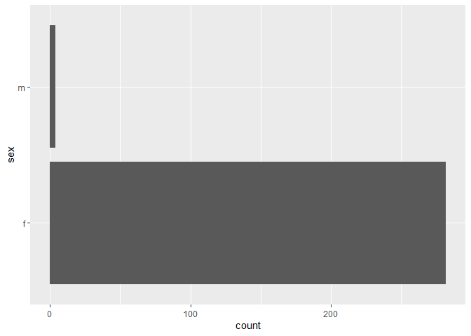
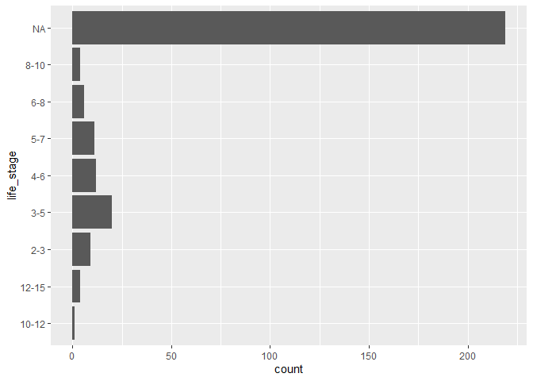
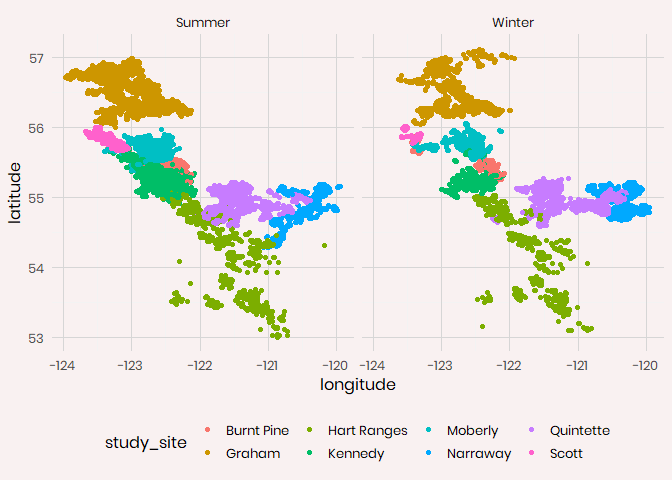
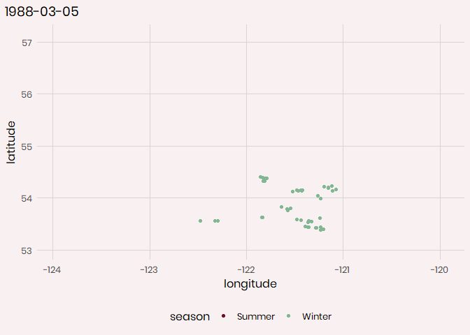
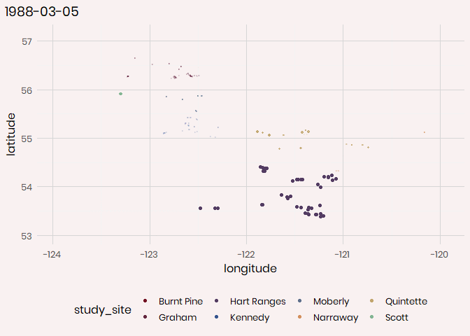
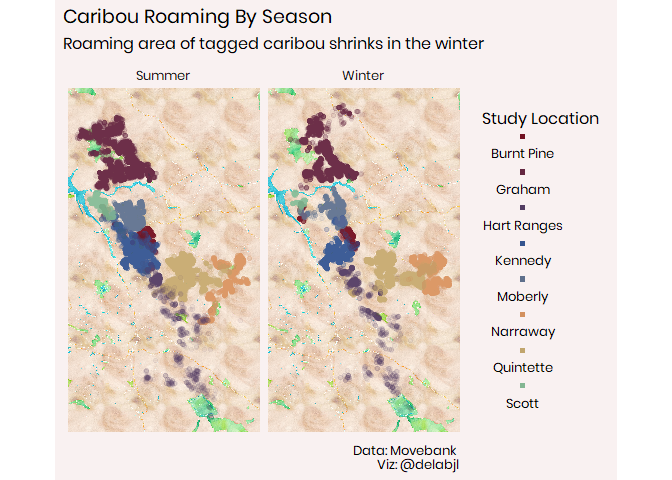

Caribou Location Tracking
================

## Fetching the data/setup

As always I begin by fetching the data from the tidytuesday repo. \#\#\#
Packages: These are the package I plan on using today:

  - tidyverse (It’s what this is all about)
  - ggtext (A wonderful package by
    \[@ClausWilke\](<https://twitter.com/ClausWilke>) that enables
    better control over text rendering)
  - patchwork (By the amazing
    \[@thomasp85\](<https://twitter.com/thomasp85>) allows for easy
    combining of plots)
  - janitor (makes it easy to clean the names of a data set.)
  - forcats (easy work with factors)
  - delabj (A personal package that includes a few tweaks to ggplot, and
    custom themes on github use
    devtools::install\_github(“delabj/delabj”) to install)
  - wesanderson has some interesting color palettes
  - various geospatial tools

Let’s take a look at what we have in the datasets

``` r
glimpse(individuals)
```

    ## Rows: 286
    ## Columns: 14
    ## $ animal_id            <chr> "HR_151.510", "GR_C04", "GR_C03", "HR_151.805"...
    ## $ sex                  <chr> "f", "f", "f", "f", "f", "f", "f", "f", "f", "...
    ## $ life_stage           <chr> NA, NA, NA, NA, NA, NA, NA, NA, NA, NA, NA, NA...
    ## $ pregnant             <lgl> NA, NA, NA, NA, NA, NA, NA, NA, NA, NA, NA, NA...
    ## $ with_calf            <lgl> NA, NA, NA, NA, NA, NA, NA, NA, NA, NA, NA, NA...
    ## $ death_cause          <chr> NA, NA, NA, NA, NA, NA, NA, NA, "Unknown", NA,...
    ## $ study_site           <chr> "Hart Ranges", "Graham", "Graham", "Hart Range...
    ## $ deploy_on_longitude  <dbl> NA, NA, NA, NA, NA, NA, NA, NA, NA, NA, NA, NA...
    ## $ deploy_on_latitude   <dbl> NA, NA, NA, NA, NA, NA, NA, NA, NA, NA, NA, NA...
    ## $ deploy_on_comments   <chr> NA, NA, NA, NA, NA, NA, NA, NA, NA, NA, NA, NA...
    ## $ deploy_off_longitude <dbl> NA, NA, NA, NA, NA, NA, NA, NA, -122.6405, NA,...
    ## $ deploy_off_latitude  <dbl> NA, NA, NA, NA, NA, NA, NA, NA, 55.26054, NA, ...
    ## $ deploy_off_type      <chr> "unknown", "unknown", "unknown", "unknown", "u...
    ## $ deploy_off_comments  <chr> NA, NA, NA, NA, NA, NA, NA, NA, NA, NA, NA, NA...

``` r
summary(individuals)
```

    ##   animal_id             sex             life_stage         pregnant      
    ##  Length:286         Length:286         Length:286         Mode :logical  
    ##  Class :character   Class :character   Class :character   FALSE:3        
    ##  Mode  :character   Mode  :character   Mode  :character   TRUE :16       
    ##                                                           NA's :267      
    ##                                                                          
    ##                                                                          
    ##                                                                          
    ##  with_calf       death_cause         study_site        deploy_on_longitude
    ##  Mode :logical   Length:286         Length:286         Min.   :-123.4     
    ##  FALSE:66        Class :character   Class :character   1st Qu.:-122.6     
    ##  TRUE :18        Mode  :character   Mode  :character   Median :-122.1     
    ##  NA's :202                                             Mean   :-121.9     
    ##                                                        3rd Qu.:-121.3     
    ##                                                        Max.   :-120.2     
    ##                                                        NA's   :133        
    ##  deploy_on_latitude deploy_on_comments deploy_off_longitude deploy_off_latitude
    ##  Min.   :28.13      Length:286         Min.   :-123.6       Min.   :54.62      
    ##  1st Qu.:54.94      Class :character   1st Qu.:-122.5       1st Qu.:54.91      
    ##  Median :55.14      Mode  :character   Median :-122.3       Median :55.14      
    ##  Mean   :55.04                         Mean   :-121.9       Mean   :55.21      
    ##  3rd Qu.:55.33                         3rd Qu.:-121.3       3rd Qu.:55.40      
    ##  Max.   :55.99                         Max.   :-119.8       Max.   :55.95      
    ##  NA's   :133                           NA's   :230          NA's   :230        
    ##  deploy_off_type    deploy_off_comments
    ##  Length:286         Length:286         
    ##  Class :character   Class :character   
    ##  Mode  :character   Mode  :character   
    ##                                        
    ##                                        
    ##                                        
    ## 

``` r
glimpse(locations)
```

    ## Rows: 249,450
    ## Columns: 7
    ## $ event_id   <dbl> 2259197332, 2259197333, 2259197334, 2259197335, 22591973...
    ## $ animal_id  <chr> "GR_C01", "GR_C01", "GR_C01", "GR_C01", "GR_C01", "GR_C0...
    ## $ study_site <chr> "Graham", "Graham", "Graham", "Graham", "Graham", "Graha...
    ## $ season     <chr> "Winter", "Winter", "Winter", "Winter", "Winter", "Winte...
    ## $ timestamp  <dttm> 2001-02-21 05:00:00, 2001-02-21 09:00:00, 2001-02-21 13...
    ## $ longitude  <dbl> -122.5200, -122.5224, -122.5232, -122.5328, -122.5314, -...
    ## $ latitude   <dbl> 56.23950, 56.23985, 56.24000, 56.23187, 56.23402, 56.233...

The individuals data set seems to be pretty messy/inconsistent. It’s
also missing a lot of data. for example the number of options in death
cause

``` r
individuals$death_cause %>% tolower()%>% as.factor() %>% summary()
```

    ##                                                   accidental, collar still in field, inaccessible 
    ##                                                                                                 1 
    ##                                                                  accidental.  caught in tree well 
    ##                                                                                                 1 
    ##                                                                             collar still in field 
    ##                                                                                                 2 
    ##                                                                               predation - grizzly 
    ##                                                                                                 3 
    ##                                                                          predation - grizzly bear 
    ##                                                                                                 1 
    ##                                                                      predation - unknown predator 
    ##                                                                                                 5 
    ##                                                                                  predation - wolf 
    ##                                                                                                14 
    ##                                                                                   train collision 
    ##                                                                                                 1 
    ##                                                                                           unknown 
    ##                                                                                                11 
    ##                                                 unknown.  collar inaccessible and still in field. 
    ##                                                                                                 1 
    ## unknown.  found 50m from trend open pit mine.  area littered with rock from blasts from the mine. 
    ##                                                                                                 1 
    ##                                                                     unknown.  suspected predation 
    ##                                                                                                 7 
    ##                                        unknown.  suspected wolf (or possibly wolverine) predation 
    ##                                                                                                 1 
    ##                                                                unknown.  suspected wolf predation 
    ##                                                                                                 4 
    ##                                                                                 vehicle collision 
    ##                                                                                                 1 
    ##                                                                                              NA's 
    ##                                                                                               232

First there’s a lot of missing data. I’m assuming that means the animal
is not dead, which is good\! But of those that remain as options there’s
a lot of variation. I can clean up a fair amount of these. I think I’ll
use the following categories:

  - predation
  - collision
  - accidental
  - unknown
  - [still alive](https://www.youtube.com/watch?v=Y6ljFaKRTrI)

<!-- end list -->

``` r
individuals_cleaned <- individuals %>%
  mutate(
    death_cause = replace_na(death_cause, "still alive"),
    death_cause = case_when(
        str_detect(death_cause, "predation")    ~ "predation",
        str_detect(death_cause, "collision")    ~ "collision",
        str_detect(death_cause, "accidental")   ~ "accidental",
        str_detect(death_cause, "unknown")      ~ "unknown",
        str_detect(death_cause, "still alive")  ~ "still alive",
        TRUE ~ "NA"
    ))
```

When looking at the other columns, there are a lot of NA values. This is
likely just because some of the information doesn’t apply or wasn’t
recorded. I’m not sure how much can be done with this data set tbh. It’s
worth noting that there doesn’t seem to be many males in this data set,
which might be something mentioned in the origional study. Life stage is
also missing a lot of data.

``` r
individuals_cleaned %>% 
  ggplot(aes(y=sex))+
  geom_bar()
```

<!-- -->

``` r
individuals_cleaned %>% 
  ggplot(aes(y=life_stage))+
  geom_bar()
```

<!-- -->

So looking at the locations dataframe and we have a much more complete
data set.

``` r
summary(locations)
```

    ##     event_id          animal_id          study_site           season         
    ##  Min.   :2.259e+09   Length:249450      Length:249450      Length:249450     
    ##  1st Qu.:2.270e+09   Class :character   Class :character   Class :character  
    ##  Median :2.270e+09   Mode  :character   Mode  :character   Mode  :character  
    ##  Mean   :2.268e+09                                                           
    ##  3rd Qu.:2.270e+09                                                           
    ##  Max.   :2.283e+09                                                           
    ##    timestamp                     longitude         latitude    
    ##  Min.   :1988-03-05 20:00:00   Min.   :-124.0   Min.   :53.01  
    ##  1st Qu.:2007-07-25 23:18:09   1st Qu.:-122.7   1st Qu.:55.07  
    ##  Median :2009-06-11 02:03:04   Median :-122.5   Median :55.17  
    ##  Mean   :2009-04-11 22:00:24   Mean   :-122.1   Mean   :55.44  
    ##  3rd Qu.:2012-03-19 02:00:43   3rd Qu.:-121.4   3rd Qu.:55.85  
    ##  Max.   :2016-07-31 20:02:08   Max.   :-119.9   Max.   :57.13

There’s probably some interesting involving migratory patterns. For
example look at how the shapes change between seasons

``` r
locations %>%
  ggplot(aes(x=longitude, y=latitude, color  = study_site))+
  facet_wrap(~season)+
  geom_point()+
  legend_bottom()+
  theme_delabj()
```

<!-- -->

``` r
locations %>%
  mutate(date =  lubridate::date(timestamp)) %>%
  ggplot(aes(x=longitude, y=latitude, color  = season))+
  geom_point()+
  labs(title = "{frame_time}")+
  legend_bottom()+
  theme_delabj()+
  scale_color_delabj()+
  transition_time(date)+
  shadow_mark(past = TRUE, future = FALSE, alpha = .1)
```

<!-- -->

``` r
locations %>%
  mutate(date =  lubridate::date(timestamp)) %>%
  ggplot(aes(x=longitude, y=latitude, color  = season))+
  geom_point()+
  labs(title = "{frame_time}")+
  legend_bottom()+
  theme_delabj()+
  scale_color_delabj()+
  transition_time(date)+
  shadow_wake(wake_length = .25, alpha = .1)
```

<!-- -->

It looks like there might be a pretty clear look at some migration in
that the early 90s?

I wonder if any of the subjects are shared between the sites

``` r
# This is likely the worst way to approach this

locations %>%
  group_by(animal_id, study_site) %>%
  count() %>%
  arrange(animal_id) %>%
  ungroup %>%
  select(animal_id) %>%
  group_by(animal_id) %>% 
  count() %>% 
  arrange(n)
```

    ## # A tibble: 260 x 2
    ## # Groups:   animal_id [260]
    ##    animal_id     n
    ##    <chr>     <int>
    ##  1 BP_car022     1
    ##  2 BP_car023     1
    ##  3 BP_car032     1
    ##  4 BP_car043     1
    ##  5 BP_car100     1
    ##  6 BP_car101     1
    ##  7 BP_car115     1
    ##  8 BP_car144     1
    ##  9 BP_car145     1
    ## 10 GR_C01        1
    ## # ... with 250 more rows

``` r
locations %>% 
  group_by(season) %>%
  count()
```

    ## # A tibble: 2 x 2
    ## # Groups:   season [2]
    ##   season      n
    ##   <chr>   <int>
    ## 1 Summer 138437
    ## 2 Winter 111013

It doesn’t look like it (based on the `animal_id`) but it makes me
wonder about retagging. I wish I had a shapefile for the survey sites.

I want to add these points to an actual map / color by site?

``` r
locations %>%
  mutate(date =  lubridate::date(timestamp)) %>%
  ggplot(aes(x=longitude, y=latitude, color  = study_site))+
  geom_point()+
  labs(title = "{frame_time}")+
  legend_bottom()+
  theme_delabj()+
  scale_color_delabj()+
  transition_time(date)+
  shadow_wake(wake_length = .5, alpha = .1)
```

<!-- -->

Coloring by site seems to hide the movement.

The roaming locations seem to shrink in the winter season. Though there
are fewer recordings in the winter.

``` r
boundries <- ggmap::make_bbox(lat=latitude, lon = longitude, data =locations)
basemap = ggmap::get_stamenmap(bbox = boundries,  maptype = "watercolor") 
```

    ## 336 tiles needed, this may take a while (try a smaller zoom).

    ## Source : http://tile.stamen.com/watercolor/10/158/311.jpg

    ## Source : http://tile.stamen.com/watercolor/10/159/311.jpg

    ## Source : http://tile.stamen.com/watercolor/10/160/311.jpg

    ## Source : http://tile.stamen.com/watercolor/10/161/311.jpg

    ## Source : http://tile.stamen.com/watercolor/10/162/311.jpg

    ## Source : http://tile.stamen.com/watercolor/10/163/311.jpg

    ## Source : http://tile.stamen.com/watercolor/10/164/311.jpg

    ## Source : http://tile.stamen.com/watercolor/10/165/311.jpg

    ## Source : http://tile.stamen.com/watercolor/10/166/311.jpg

    ## Source : http://tile.stamen.com/watercolor/10/167/311.jpg

    ## Source : http://tile.stamen.com/watercolor/10/168/311.jpg

    ## Source : http://tile.stamen.com/watercolor/10/169/311.jpg

    ## Source : http://tile.stamen.com/watercolor/10/170/311.jpg

    ## Source : http://tile.stamen.com/watercolor/10/171/311.jpg

    ## Source : http://tile.stamen.com/watercolor/10/158/312.jpg

    ## Source : http://tile.stamen.com/watercolor/10/159/312.jpg

    ## Source : http://tile.stamen.com/watercolor/10/160/312.jpg

    ## Source : http://tile.stamen.com/watercolor/10/161/312.jpg

    ## Source : http://tile.stamen.com/watercolor/10/162/312.jpg

    ## Source : http://tile.stamen.com/watercolor/10/163/312.jpg

    ## Source : http://tile.stamen.com/watercolor/10/164/312.jpg

    ## Source : http://tile.stamen.com/watercolor/10/165/312.jpg

    ## Source : http://tile.stamen.com/watercolor/10/166/312.jpg

    ## Source : http://tile.stamen.com/watercolor/10/167/312.jpg

    ## Source : http://tile.stamen.com/watercolor/10/168/312.jpg

    ## Source : http://tile.stamen.com/watercolor/10/169/312.jpg

    ## Source : http://tile.stamen.com/watercolor/10/170/312.jpg

    ## Source : http://tile.stamen.com/watercolor/10/171/312.jpg

    ## Source : http://tile.stamen.com/watercolor/10/158/313.jpg

    ## Source : http://tile.stamen.com/watercolor/10/159/313.jpg

    ## Source : http://tile.stamen.com/watercolor/10/160/313.jpg

    ## Source : http://tile.stamen.com/watercolor/10/161/313.jpg

    ## Source : http://tile.stamen.com/watercolor/10/162/313.jpg

    ## Source : http://tile.stamen.com/watercolor/10/163/313.jpg

    ## Source : http://tile.stamen.com/watercolor/10/164/313.jpg

    ## Source : http://tile.stamen.com/watercolor/10/165/313.jpg

    ## Source : http://tile.stamen.com/watercolor/10/166/313.jpg

    ## Source : http://tile.stamen.com/watercolor/10/167/313.jpg

    ## Source : http://tile.stamen.com/watercolor/10/168/313.jpg

    ## Source : http://tile.stamen.com/watercolor/10/169/313.jpg

    ## Source : http://tile.stamen.com/watercolor/10/170/313.jpg

    ## Source : http://tile.stamen.com/watercolor/10/171/313.jpg

    ## Source : http://tile.stamen.com/watercolor/10/158/314.jpg

    ## Source : http://tile.stamen.com/watercolor/10/159/314.jpg

    ## Source : http://tile.stamen.com/watercolor/10/160/314.jpg

    ## Source : http://tile.stamen.com/watercolor/10/161/314.jpg

    ## Source : http://tile.stamen.com/watercolor/10/162/314.jpg

    ## Source : http://tile.stamen.com/watercolor/10/163/314.jpg

    ## Source : http://tile.stamen.com/watercolor/10/164/314.jpg

    ## Source : http://tile.stamen.com/watercolor/10/165/314.jpg

    ## Source : http://tile.stamen.com/watercolor/10/166/314.jpg

    ## Source : http://tile.stamen.com/watercolor/10/167/314.jpg

    ## Source : http://tile.stamen.com/watercolor/10/168/314.jpg

    ## Source : http://tile.stamen.com/watercolor/10/169/314.jpg

    ## Source : http://tile.stamen.com/watercolor/10/170/314.jpg

    ## Source : http://tile.stamen.com/watercolor/10/171/314.jpg

    ## Source : http://tile.stamen.com/watercolor/10/158/315.jpg

    ## Source : http://tile.stamen.com/watercolor/10/159/315.jpg

    ## Source : http://tile.stamen.com/watercolor/10/160/315.jpg

    ## Source : http://tile.stamen.com/watercolor/10/161/315.jpg

    ## Source : http://tile.stamen.com/watercolor/10/162/315.jpg

    ## Source : http://tile.stamen.com/watercolor/10/163/315.jpg

    ## Source : http://tile.stamen.com/watercolor/10/164/315.jpg

    ## Source : http://tile.stamen.com/watercolor/10/165/315.jpg

    ## Source : http://tile.stamen.com/watercolor/10/166/315.jpg

    ## Source : http://tile.stamen.com/watercolor/10/167/315.jpg

    ## Source : http://tile.stamen.com/watercolor/10/168/315.jpg

    ## Source : http://tile.stamen.com/watercolor/10/169/315.jpg

    ## Source : http://tile.stamen.com/watercolor/10/170/315.jpg

    ## Source : http://tile.stamen.com/watercolor/10/171/315.jpg

    ## Source : http://tile.stamen.com/watercolor/10/158/316.jpg

    ## Source : http://tile.stamen.com/watercolor/10/159/316.jpg

    ## Source : http://tile.stamen.com/watercolor/10/160/316.jpg

    ## Source : http://tile.stamen.com/watercolor/10/161/316.jpg

    ## Source : http://tile.stamen.com/watercolor/10/162/316.jpg

    ## Source : http://tile.stamen.com/watercolor/10/163/316.jpg

    ## Source : http://tile.stamen.com/watercolor/10/164/316.jpg

    ## Source : http://tile.stamen.com/watercolor/10/165/316.jpg

    ## Source : http://tile.stamen.com/watercolor/10/166/316.jpg

    ## Source : http://tile.stamen.com/watercolor/10/167/316.jpg

    ## Source : http://tile.stamen.com/watercolor/10/168/316.jpg

    ## Source : http://tile.stamen.com/watercolor/10/169/316.jpg

    ## Source : http://tile.stamen.com/watercolor/10/170/316.jpg

    ## Source : http://tile.stamen.com/watercolor/10/171/316.jpg

    ## Source : http://tile.stamen.com/watercolor/10/158/317.jpg

    ## Source : http://tile.stamen.com/watercolor/10/159/317.jpg

    ## Source : http://tile.stamen.com/watercolor/10/160/317.jpg

    ## Source : http://tile.stamen.com/watercolor/10/161/317.jpg

    ## Source : http://tile.stamen.com/watercolor/10/162/317.jpg

    ## Source : http://tile.stamen.com/watercolor/10/163/317.jpg

    ## Source : http://tile.stamen.com/watercolor/10/164/317.jpg

    ## Source : http://tile.stamen.com/watercolor/10/165/317.jpg

    ## Source : http://tile.stamen.com/watercolor/10/166/317.jpg

    ## Source : http://tile.stamen.com/watercolor/10/167/317.jpg

    ## Source : http://tile.stamen.com/watercolor/10/168/317.jpg

    ## Source : http://tile.stamen.com/watercolor/10/169/317.jpg

    ## Source : http://tile.stamen.com/watercolor/10/170/317.jpg

    ## Source : http://tile.stamen.com/watercolor/10/171/317.jpg

    ## Source : http://tile.stamen.com/watercolor/10/158/318.jpg

    ## Source : http://tile.stamen.com/watercolor/10/159/318.jpg

    ## Source : http://tile.stamen.com/watercolor/10/160/318.jpg

    ## Source : http://tile.stamen.com/watercolor/10/161/318.jpg

    ## Source : http://tile.stamen.com/watercolor/10/162/318.jpg

    ## Source : http://tile.stamen.com/watercolor/10/163/318.jpg

    ## Source : http://tile.stamen.com/watercolor/10/164/318.jpg

    ## Source : http://tile.stamen.com/watercolor/10/165/318.jpg

    ## Source : http://tile.stamen.com/watercolor/10/166/318.jpg

    ## Source : http://tile.stamen.com/watercolor/10/167/318.jpg

    ## Source : http://tile.stamen.com/watercolor/10/168/318.jpg

    ## Source : http://tile.stamen.com/watercolor/10/169/318.jpg

    ## Source : http://tile.stamen.com/watercolor/10/170/318.jpg

    ## Source : http://tile.stamen.com/watercolor/10/171/318.jpg

    ## Source : http://tile.stamen.com/watercolor/10/158/319.jpg

    ## Source : http://tile.stamen.com/watercolor/10/159/319.jpg

    ## Source : http://tile.stamen.com/watercolor/10/160/319.jpg

    ## Source : http://tile.stamen.com/watercolor/10/161/319.jpg

    ## Source : http://tile.stamen.com/watercolor/10/162/319.jpg

    ## Source : http://tile.stamen.com/watercolor/10/163/319.jpg

    ## Source : http://tile.stamen.com/watercolor/10/164/319.jpg

    ## Source : http://tile.stamen.com/watercolor/10/165/319.jpg

    ## Source : http://tile.stamen.com/watercolor/10/166/319.jpg

    ## Source : http://tile.stamen.com/watercolor/10/167/319.jpg

    ## Source : http://tile.stamen.com/watercolor/10/168/319.jpg

    ## Source : http://tile.stamen.com/watercolor/10/169/319.jpg

    ## Source : http://tile.stamen.com/watercolor/10/170/319.jpg

    ## Source : http://tile.stamen.com/watercolor/10/171/319.jpg

    ## Source : http://tile.stamen.com/watercolor/10/158/320.jpg

    ## Source : http://tile.stamen.com/watercolor/10/159/320.jpg

    ## Source : http://tile.stamen.com/watercolor/10/160/320.jpg

    ## Source : http://tile.stamen.com/watercolor/10/161/320.jpg

    ## Source : http://tile.stamen.com/watercolor/10/162/320.jpg

    ## Source : http://tile.stamen.com/watercolor/10/163/320.jpg

    ## Source : http://tile.stamen.com/watercolor/10/164/320.jpg

    ## Source : http://tile.stamen.com/watercolor/10/165/320.jpg

    ## Source : http://tile.stamen.com/watercolor/10/166/320.jpg

    ## Source : http://tile.stamen.com/watercolor/10/167/320.jpg

    ## Source : http://tile.stamen.com/watercolor/10/168/320.jpg

    ## Source : http://tile.stamen.com/watercolor/10/169/320.jpg

    ## Source : http://tile.stamen.com/watercolor/10/170/320.jpg

    ## Source : http://tile.stamen.com/watercolor/10/171/320.jpg

    ## Source : http://tile.stamen.com/watercolor/10/158/321.jpg

    ## Source : http://tile.stamen.com/watercolor/10/159/321.jpg

    ## Source : http://tile.stamen.com/watercolor/10/160/321.jpg

    ## Source : http://tile.stamen.com/watercolor/10/161/321.jpg

    ## Source : http://tile.stamen.com/watercolor/10/162/321.jpg

    ## Source : http://tile.stamen.com/watercolor/10/163/321.jpg

    ## Source : http://tile.stamen.com/watercolor/10/164/321.jpg

    ## Source : http://tile.stamen.com/watercolor/10/165/321.jpg

    ## Source : http://tile.stamen.com/watercolor/10/166/321.jpg

    ## Source : http://tile.stamen.com/watercolor/10/167/321.jpg

    ## Source : http://tile.stamen.com/watercolor/10/168/321.jpg

    ## Source : http://tile.stamen.com/watercolor/10/169/321.jpg

    ## Source : http://tile.stamen.com/watercolor/10/170/321.jpg

    ## Source : http://tile.stamen.com/watercolor/10/171/321.jpg

    ## Source : http://tile.stamen.com/watercolor/10/158/322.jpg

    ## Source : http://tile.stamen.com/watercolor/10/159/322.jpg

    ## Source : http://tile.stamen.com/watercolor/10/160/322.jpg

    ## Source : http://tile.stamen.com/watercolor/10/161/322.jpg

    ## Source : http://tile.stamen.com/watercolor/10/162/322.jpg

    ## Source : http://tile.stamen.com/watercolor/10/163/322.jpg

    ## Source : http://tile.stamen.com/watercolor/10/164/322.jpg

    ## Source : http://tile.stamen.com/watercolor/10/165/322.jpg

    ## Source : http://tile.stamen.com/watercolor/10/166/322.jpg

    ## Source : http://tile.stamen.com/watercolor/10/167/322.jpg

    ## Source : http://tile.stamen.com/watercolor/10/168/322.jpg

    ## Source : http://tile.stamen.com/watercolor/10/169/322.jpg

    ## Source : http://tile.stamen.com/watercolor/10/170/322.jpg

    ## Source : http://tile.stamen.com/watercolor/10/171/322.jpg

    ## Source : http://tile.stamen.com/watercolor/10/158/323.jpg

    ## Source : http://tile.stamen.com/watercolor/10/159/323.jpg

    ## Source : http://tile.stamen.com/watercolor/10/160/323.jpg

    ## Source : http://tile.stamen.com/watercolor/10/161/323.jpg

    ## Source : http://tile.stamen.com/watercolor/10/162/323.jpg

    ## Source : http://tile.stamen.com/watercolor/10/163/323.jpg

    ## Source : http://tile.stamen.com/watercolor/10/164/323.jpg

    ## Source : http://tile.stamen.com/watercolor/10/165/323.jpg

    ## Source : http://tile.stamen.com/watercolor/10/166/323.jpg

    ## Source : http://tile.stamen.com/watercolor/10/167/323.jpg

    ## Source : http://tile.stamen.com/watercolor/10/168/323.jpg

    ## Source : http://tile.stamen.com/watercolor/10/169/323.jpg

    ## Source : http://tile.stamen.com/watercolor/10/170/323.jpg

    ## Source : http://tile.stamen.com/watercolor/10/171/323.jpg

    ## Source : http://tile.stamen.com/watercolor/10/158/324.jpg

    ## Source : http://tile.stamen.com/watercolor/10/159/324.jpg

    ## Source : http://tile.stamen.com/watercolor/10/160/324.jpg

    ## Source : http://tile.stamen.com/watercolor/10/161/324.jpg

    ## Source : http://tile.stamen.com/watercolor/10/162/324.jpg

    ## Source : http://tile.stamen.com/watercolor/10/163/324.jpg

    ## Source : http://tile.stamen.com/watercolor/10/164/324.jpg

    ## Source : http://tile.stamen.com/watercolor/10/165/324.jpg

    ## Source : http://tile.stamen.com/watercolor/10/166/324.jpg

    ## Source : http://tile.stamen.com/watercolor/10/167/324.jpg

    ## Source : http://tile.stamen.com/watercolor/10/168/324.jpg

    ## Source : http://tile.stamen.com/watercolor/10/169/324.jpg

    ## Source : http://tile.stamen.com/watercolor/10/170/324.jpg

    ## Source : http://tile.stamen.com/watercolor/10/171/324.jpg

    ## Source : http://tile.stamen.com/watercolor/10/158/325.jpg

    ## Source : http://tile.stamen.com/watercolor/10/159/325.jpg

    ## Source : http://tile.stamen.com/watercolor/10/160/325.jpg

    ## Source : http://tile.stamen.com/watercolor/10/161/325.jpg

    ## Source : http://tile.stamen.com/watercolor/10/162/325.jpg

    ## Source : http://tile.stamen.com/watercolor/10/163/325.jpg

    ## Source : http://tile.stamen.com/watercolor/10/164/325.jpg

    ## Source : http://tile.stamen.com/watercolor/10/165/325.jpg

    ## Source : http://tile.stamen.com/watercolor/10/166/325.jpg

    ## Source : http://tile.stamen.com/watercolor/10/167/325.jpg

    ## Source : http://tile.stamen.com/watercolor/10/168/325.jpg

    ## Source : http://tile.stamen.com/watercolor/10/169/325.jpg

    ## Source : http://tile.stamen.com/watercolor/10/170/325.jpg

    ## Source : http://tile.stamen.com/watercolor/10/171/325.jpg

    ## Source : http://tile.stamen.com/watercolor/10/158/326.jpg

    ## Source : http://tile.stamen.com/watercolor/10/159/326.jpg

    ## Source : http://tile.stamen.com/watercolor/10/160/326.jpg

    ## Source : http://tile.stamen.com/watercolor/10/161/326.jpg

    ## Source : http://tile.stamen.com/watercolor/10/162/326.jpg

    ## Source : http://tile.stamen.com/watercolor/10/163/326.jpg

    ## Source : http://tile.stamen.com/watercolor/10/164/326.jpg

    ## Source : http://tile.stamen.com/watercolor/10/165/326.jpg

    ## Source : http://tile.stamen.com/watercolor/10/166/326.jpg

    ## Source : http://tile.stamen.com/watercolor/10/167/326.jpg

    ## Source : http://tile.stamen.com/watercolor/10/168/326.jpg

    ## Source : http://tile.stamen.com/watercolor/10/169/326.jpg

    ## Source : http://tile.stamen.com/watercolor/10/170/326.jpg

    ## Source : http://tile.stamen.com/watercolor/10/171/326.jpg

    ## Source : http://tile.stamen.com/watercolor/10/158/327.jpg

    ## Source : http://tile.stamen.com/watercolor/10/159/327.jpg

    ## Source : http://tile.stamen.com/watercolor/10/160/327.jpg

    ## Source : http://tile.stamen.com/watercolor/10/161/327.jpg

    ## Source : http://tile.stamen.com/watercolor/10/162/327.jpg

    ## Source : http://tile.stamen.com/watercolor/10/163/327.jpg

    ## Source : http://tile.stamen.com/watercolor/10/164/327.jpg

    ## Source : http://tile.stamen.com/watercolor/10/165/327.jpg

    ## Source : http://tile.stamen.com/watercolor/10/166/327.jpg

    ## Source : http://tile.stamen.com/watercolor/10/167/327.jpg

    ## Source : http://tile.stamen.com/watercolor/10/168/327.jpg

    ## Source : http://tile.stamen.com/watercolor/10/169/327.jpg

    ## Source : http://tile.stamen.com/watercolor/10/170/327.jpg

    ## Source : http://tile.stamen.com/watercolor/10/171/327.jpg

    ## Source : http://tile.stamen.com/watercolor/10/158/328.jpg

    ## Source : http://tile.stamen.com/watercolor/10/159/328.jpg

    ## Source : http://tile.stamen.com/watercolor/10/160/328.jpg

    ## Source : http://tile.stamen.com/watercolor/10/161/328.jpg

    ## Source : http://tile.stamen.com/watercolor/10/162/328.jpg

    ## Source : http://tile.stamen.com/watercolor/10/163/328.jpg

    ## Source : http://tile.stamen.com/watercolor/10/164/328.jpg

    ## Source : http://tile.stamen.com/watercolor/10/165/328.jpg

    ## Source : http://tile.stamen.com/watercolor/10/166/328.jpg

    ## Source : http://tile.stamen.com/watercolor/10/167/328.jpg

    ## Source : http://tile.stamen.com/watercolor/10/168/328.jpg

    ## Source : http://tile.stamen.com/watercolor/10/169/328.jpg

    ## Source : http://tile.stamen.com/watercolor/10/170/328.jpg

    ## Source : http://tile.stamen.com/watercolor/10/171/328.jpg

    ## Source : http://tile.stamen.com/watercolor/10/158/329.jpg

    ## Source : http://tile.stamen.com/watercolor/10/159/329.jpg

    ## Source : http://tile.stamen.com/watercolor/10/160/329.jpg

    ## Source : http://tile.stamen.com/watercolor/10/161/329.jpg

    ## Source : http://tile.stamen.com/watercolor/10/162/329.jpg

    ## Source : http://tile.stamen.com/watercolor/10/163/329.jpg

    ## Source : http://tile.stamen.com/watercolor/10/164/329.jpg

    ## Source : http://tile.stamen.com/watercolor/10/165/329.jpg

    ## Source : http://tile.stamen.com/watercolor/10/166/329.jpg

    ## Source : http://tile.stamen.com/watercolor/10/167/329.jpg

    ## Source : http://tile.stamen.com/watercolor/10/168/329.jpg

    ## Source : http://tile.stamen.com/watercolor/10/169/329.jpg

    ## Source : http://tile.stamen.com/watercolor/10/170/329.jpg

    ## Source : http://tile.stamen.com/watercolor/10/171/329.jpg

    ## Source : http://tile.stamen.com/watercolor/10/158/330.jpg

    ## Source : http://tile.stamen.com/watercolor/10/159/330.jpg

    ## Source : http://tile.stamen.com/watercolor/10/160/330.jpg

    ## Source : http://tile.stamen.com/watercolor/10/161/330.jpg

    ## Source : http://tile.stamen.com/watercolor/10/162/330.jpg

    ## Source : http://tile.stamen.com/watercolor/10/163/330.jpg

    ## Source : http://tile.stamen.com/watercolor/10/164/330.jpg

    ## Source : http://tile.stamen.com/watercolor/10/165/330.jpg

    ## Source : http://tile.stamen.com/watercolor/10/166/330.jpg

    ## Source : http://tile.stamen.com/watercolor/10/167/330.jpg

    ## Source : http://tile.stamen.com/watercolor/10/168/330.jpg

    ## Source : http://tile.stamen.com/watercolor/10/169/330.jpg

    ## Source : http://tile.stamen.com/watercolor/10/170/330.jpg

    ## Source : http://tile.stamen.com/watercolor/10/171/330.jpg

    ## Source : http://tile.stamen.com/watercolor/10/158/331.jpg

    ## Source : http://tile.stamen.com/watercolor/10/159/331.jpg

    ## Source : http://tile.stamen.com/watercolor/10/160/331.jpg

    ## Source : http://tile.stamen.com/watercolor/10/161/331.jpg

    ## Source : http://tile.stamen.com/watercolor/10/162/331.jpg

    ## Source : http://tile.stamen.com/watercolor/10/163/331.jpg

    ## Source : http://tile.stamen.com/watercolor/10/164/331.jpg

    ## Source : http://tile.stamen.com/watercolor/10/165/331.jpg

    ## Source : http://tile.stamen.com/watercolor/10/166/331.jpg

    ## Source : http://tile.stamen.com/watercolor/10/167/331.jpg

    ## Source : http://tile.stamen.com/watercolor/10/168/331.jpg

    ## Source : http://tile.stamen.com/watercolor/10/169/331.jpg

    ## Source : http://tile.stamen.com/watercolor/10/170/331.jpg

    ## Source : http://tile.stamen.com/watercolor/10/171/331.jpg

    ## Source : http://tile.stamen.com/watercolor/10/158/332.jpg

    ## Source : http://tile.stamen.com/watercolor/10/159/332.jpg

    ## Source : http://tile.stamen.com/watercolor/10/160/332.jpg

    ## Source : http://tile.stamen.com/watercolor/10/161/332.jpg

    ## Source : http://tile.stamen.com/watercolor/10/162/332.jpg

    ## Source : http://tile.stamen.com/watercolor/10/163/332.jpg

    ## Source : http://tile.stamen.com/watercolor/10/164/332.jpg

    ## Source : http://tile.stamen.com/watercolor/10/165/332.jpg

    ## Source : http://tile.stamen.com/watercolor/10/166/332.jpg

    ## Source : http://tile.stamen.com/watercolor/10/167/332.jpg

    ## Source : http://tile.stamen.com/watercolor/10/168/332.jpg

    ## Source : http://tile.stamen.com/watercolor/10/169/332.jpg

    ## Source : http://tile.stamen.com/watercolor/10/170/332.jpg

    ## Source : http://tile.stamen.com/watercolor/10/171/332.jpg

    ## Source : http://tile.stamen.com/watercolor/10/158/333.jpg

    ## Source : http://tile.stamen.com/watercolor/10/159/333.jpg

    ## Source : http://tile.stamen.com/watercolor/10/160/333.jpg

    ## Source : http://tile.stamen.com/watercolor/10/161/333.jpg

    ## Source : http://tile.stamen.com/watercolor/10/162/333.jpg

    ## Source : http://tile.stamen.com/watercolor/10/163/333.jpg

    ## Source : http://tile.stamen.com/watercolor/10/164/333.jpg

    ## Source : http://tile.stamen.com/watercolor/10/165/333.jpg

    ## Source : http://tile.stamen.com/watercolor/10/166/333.jpg

    ## Source : http://tile.stamen.com/watercolor/10/167/333.jpg

    ## Source : http://tile.stamen.com/watercolor/10/168/333.jpg

    ## Source : http://tile.stamen.com/watercolor/10/169/333.jpg

    ## Source : http://tile.stamen.com/watercolor/10/170/333.jpg

    ## Source : http://tile.stamen.com/watercolor/10/171/333.jpg

    ## Source : http://tile.stamen.com/watercolor/10/158/334.jpg

    ## Source : http://tile.stamen.com/watercolor/10/159/334.jpg

    ## Source : http://tile.stamen.com/watercolor/10/160/334.jpg

    ## Source : http://tile.stamen.com/watercolor/10/161/334.jpg

    ## Source : http://tile.stamen.com/watercolor/10/162/334.jpg

    ## Source : http://tile.stamen.com/watercolor/10/163/334.jpg

    ## Source : http://tile.stamen.com/watercolor/10/164/334.jpg

    ## Source : http://tile.stamen.com/watercolor/10/165/334.jpg

    ## Source : http://tile.stamen.com/watercolor/10/166/334.jpg

    ## Source : http://tile.stamen.com/watercolor/10/167/334.jpg

    ## Source : http://tile.stamen.com/watercolor/10/168/334.jpg

    ## Source : http://tile.stamen.com/watercolor/10/169/334.jpg

    ## Source : http://tile.stamen.com/watercolor/10/170/334.jpg

    ## Source : http://tile.stamen.com/watercolor/10/171/334.jpg

``` r
ggmap::ggmap(basemap)+
  facet_wrap(~season)+
  geom_point(data=locations, aes(x=longitude, y=latitude, color  = study_site), alpha = 0.05)+
  labs(title = "Caribou Roaming By Season",
       subtitle = "Roaming area of tagged caribou shrinks in the winter",
       color = "Study Location",
       x=NULL,
       y=NULL,
       caption= "Data: Movebank \nViz: @delabjl")+
  guides(color= guide_legend(
    title.position = "top", 
    title.hjust = .5, 
    label.position = "bottom",
    keywidth = 1,
  keyheight = .25,
  ncol = 1, 
  override.aes = c(alpha=1,
                   shape = 15)
  ))+
  theme_delabj()+
  legend_right()+
  gridlines_off()+
  scale_color_delabj()+
  theme(axis.title.x=element_blank(),
        axis.text.x=element_blank(),
        axis.ticks.x=element_blank())+
  theme(axis.title.y=element_blank(),
        axis.text.y=element_blank(),
        axis.ticks.y=element_blank())
```

<!-- -->

``` r
ggsave("watercolor_locations.png", dpi = 320, type = "cairo")
```

    ## Saving 7 x 5 in image

``` r
locations_date <- locations %>%
  mutate(date =  lubridate::date(timestamp))

ggmap::ggmap(basemap) +
  geom_point(data =locations_date, aes(x=longitude, y=latitude, color  = season), alpha = .6)+
  labs(
    title = "<b style='color:#721121'>Summer</b> & <b style='color:#5B3758'>Winter</b> Migrations?",
    subtitle = "Locations of caribou on {frame_time}",
    x=NULL,
    y=NULL,
    caption= "Data: Movebank \nViz: @delabjl"
    )+
  transition_time(date)+
  shadow_wake(wake_length = .25, alpha = .1)+
  theme_delabj()+
  scale_color_manual(values=c("#721121","#5B3758"))+
  gridlines_off()+
    theme(axis.title.x=element_blank(),
        axis.text.x=element_blank(),
        axis.ticks.x=element_blank())+
  theme(axis.title.y=element_blank(),
        axis.text.y=element_blank(),
        axis.ticks.y=element_blank())+
  legend_none()+
  theme(plot.title = element_markdown())
```

<!-- -->

``` r
#animate(p, fps = 24, duration = 45 )
anim_save("big_migration.gif", ani.width= 3250, ani.height=5800)
```

I think it would be interesting to follow the route of one of the
animals as well as a hex/heatmap of where the caribou live. But I don’t
have a ton of extra time right now to work on that.
