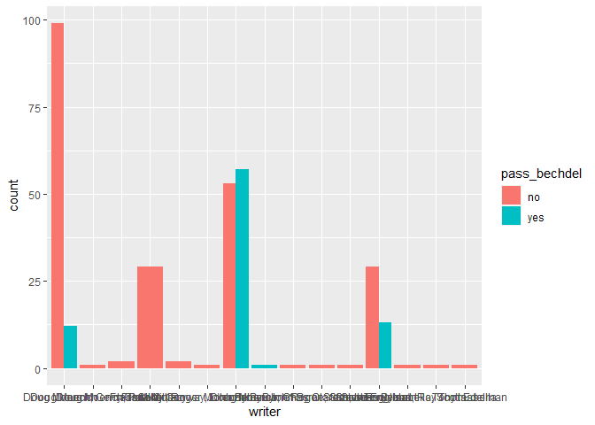
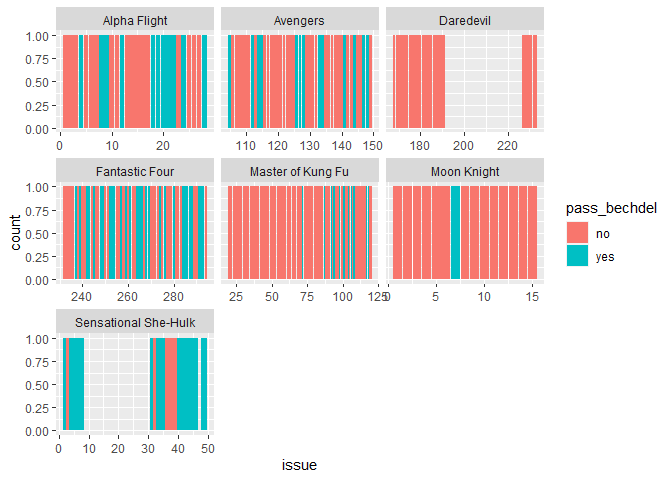
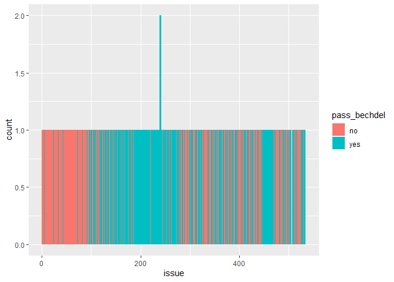
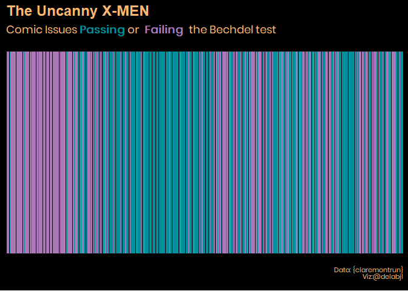
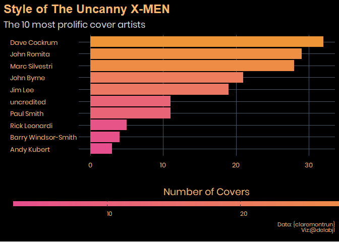
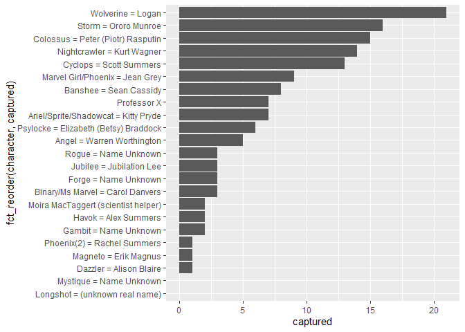
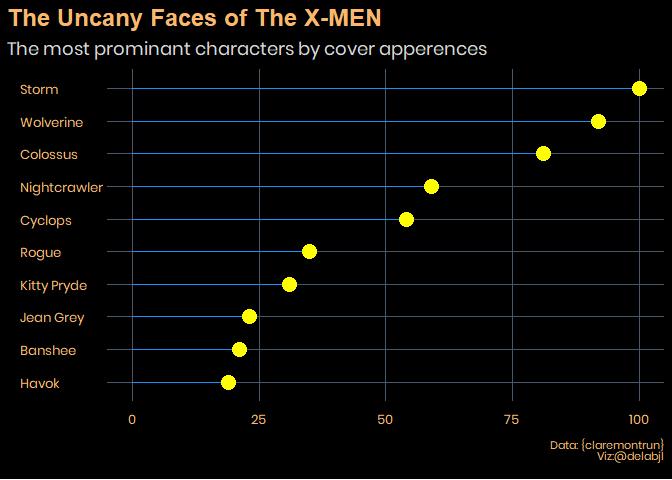

Exmen Data\!
================

## Fetching the data/setup

As always I begin by fetching the data from the tidytuesday repo. \#\#\#
Packages: These are the package I plan on using today:

  - tidyverse (It’s what this is all about)
  - ggtext (A wonderful package by
    \[@ClausWilke\](<https://twitter.com/ClausWilke>) that enables
    better control over text rendering)
  - patchwork (By the amazing
    \[@thomasp85\](<https://twitter.com/thomasp85>) allows for easy
    combining of plots)
  - janitor (makes it easy to clean the names of a data set.)
  - forcats (easy work with factors)
  - delabj (A personal package that includes a few tweaks to ggplot, and
    custom themes on github use
    devtools::install\_github(“delabj/delabj”) to install)
  - wesanderson has some interesting color palettes

I’m particularly excited by this data set cause the X-Men are some of my
favorite comic heros.

A few of these data sets seem to be fairly straight forward based on the
description alone. I want to start by looking at the bechdel test
datasets. I have a feeling that they wont be passing in general.

``` r
comic_bechdel %>%
  drop_na(writer, pass_bechdel) %>%
  ggplot(aes(x=writer, fill= pass_bechdel))+
  geom_bar(position = position_dodge())
```

<!-- -->

``` r
comic_bechdel %>%
  drop_na(issue,series, pass_bechdel) %>%
  ggplot(aes(x=issue, fill= pass_bechdel))+
  facet_wrap(~series, scales="free_x")+
  geom_bar(position = position_dodge())
```

<!-- -->

``` r
xmen_bechdel %>%
  drop_na(issue, pass_bechdel) %>%
  ggplot(aes(x=issue, fill= pass_bechdel))+
  geom_bar(position = position_dodge())
```

    ## Warning: position_dodge requires non-overlapping x intervals

<!-- --> I’m noticing
that the xmen data set has a few issues that are duplicated. I’ll use
{`janitor`} to see the dupes

``` r
xmen_bechdel %>% 
  janitor::get_dupes()
```

    ## No variable names specified - using all columns.

    ## # A tibble: 6 x 5
    ##   issue pass_bechdel notes reprint dupe_count
    ##   <dbl> <chr>        <chr> <lgl>        <int>
    ## 1   239 yes          <NA>  FALSE            2
    ## 2   239 yes          <NA>  FALSE            2
    ## 3   240 yes          <NA>  FALSE            2
    ## 4   240 yes          <NA>  FALSE            2
    ## 5   242 yes          <NA>  FALSE            2
    ## 6   242 yes          <NA>  FALSE            2

``` r
xmen_bechdel %>% 
  select(issue) %>%
  janitor::get_dupes()
```

    ## No variable names specified - using all columns.

    ## # A tibble: 20 x 2
    ##    issue dupe_count
    ##    <dbl>      <int>
    ##  1   235          2
    ##  2   235          2
    ##  3   236          2
    ##  4   236          2
    ##  5   237          2
    ##  6   237          2
    ##  7   238          2
    ##  8   238          2
    ##  9   239          2
    ## 10   239          2
    ## 11   240          2
    ## 12   240          2
    ## 13   241          2
    ## 14   241          2
    ## 15   242          2
    ## 16   242          2
    ## 17   243          2
    ## 18   243          2
    ## 19   244          2
    ## 20   244          2

``` r
xmen_bechdel %>%
  distinct(issue, .keep_all= TRUE) %>%
  drop_na(issue, pass_bechdel) %>%
  ggplot(aes(x=as.factor(issue), fill= pass_bechdel))+
  geom_bar()+
  theme_delabj_dark(title_font = "Arial",
                    main.text.color = "#FCB76D",
                    sub.text.color = "#FCB76D",
                    axis.text.color = "#FCB76D", 
                    title.size = 18)+
  delabj::legend_none()+
  labs(title = "<b style = 'color:#FCB76D'> The Uncanny X-MEN</b> ",
       subtitle = "<span style ='color:#FCB76D'> Comic Issues <b style='color:#008F9B'>Passing</b> or <b = style='color:#AC78BA'> Failing </b> the Bechdel test",
       caption= "Data: {claremontrun}\nViz:@delabjl"
       )+
  scale_fill_manual(values = c("#AC78BA","#008F9B"))+
  delabj:::gridlines_off()+
  theme(plot.title = element_markdown(),
        plot.subtitle = element_markdown())+
  theme(axis.title.x=element_blank(),
        axis.text.x=element_blank(),
        axis.ticks.x=element_blank(),
        axis.title.y=element_blank(),
        axis.text.y =element_blank(),
        axis.ticks.y=element_blank())+
  theme(plot.background = element_rect(fill = "black"),
        panel.background = element_rect(fill = "black", colour = NA, size=0),
        panel.border = element_blank())+
  theme(plot.title.position = "panel")+
  theme(plot.caption = element_text(size=8, 
                                    family = "Poppins", 
                                    color = "#FCB76D"))
```

<!-- -->

``` r
  ggsave("xmen_bechdel.png", height = 5, width = 10, dpi = 320,device = "png",  type = "cairo")
```

I may have spent a little more time and effort than I meant to on this
plot. I haven’t even gotten to any of the other data\!

``` r
covers %>%
  glimpse()
```

    ## Rows: 184
    ## Columns: 6
    ## $ issue                 <dbl> 97, 98, 99, 100, 101, 102, 103, 104, 105, 106...
    ## $ cover_artist          <chr> "Dave Cockrum", "Dave Cockrum", "Dave Cockrum...
    ## $ narrative_captions    <chr> "Cyclops vs. Havok -- In a duel to the death!...
    ## $ characters_visualized <chr> "Cyclops\r\nHavok\r\nColossus\r\nStorm\r\nNig...
    ## $ characters_speaking   <chr> "Storm", NA, "Colossus", NA, NA, NA, NA, NA, ...
    ## $ dialog_text           <chr> "Storm: \"Stay Back, my fellow X-Men!\"\r\nSt...

``` r
covers %>% 
  group_by(cover_artist) %>%
  count() %>%
  arrange(desc(n)) %>%
  head(10) %>%
  ggplot(aes(y=fct_reorder(cover_artist, n), x=n, fill = n)) +
  geom_bar(stat="identity")+
  labs(
    title="Style of The Uncanny X-MEN",
    subtitle = "The 10 most prolific cover artists", 
    caption= "Data: {claremontrun}\nViz:@delabjl",
    fill= "Number of Covers", 
    y=NULL,
    x= NULL
  )+

  scale_fill_gradient(low="#E64E8D", high = "#EE9537" )+
  theme_delabj_dark(title_font = "Arial",
                    main.text.color = "#FCB76D",
                    sub.text.color = "#FCB76D",
                    axis.text.color = "#FCB76D", 
                    title.size = 18)+
    guides(fill= guide_colorbar(
    title.position = "top",
    barwidth = 40,
    barheight = .5,
    ticks.colour = "black",
    hjust = .5
  ))+
  delabj:::gridlines_minor_off()+
  theme(plot.title = element_markdown(),
        plot.subtitle = element_markdown())+
  theme(plot.background = element_rect(fill = "black"),
        panel.background = element_rect(fill = "black", colour = NA, size=0),
        panel.border = element_blank())+
  theme(plot.caption = element_text(size=8, 
                                    family = "Poppins", 
                                    color = "#FCB76D"))+
  theme(axis.text.y = element_text(hjust = 0))
```

<!-- -->

``` r
  ggsave("artist_top10.png", height = 5, width = 10, dpi = 320,device = "png",  type = "cairo")
```

The character dataframe is super rich as well\! (Might come back to do
some modeling with this at a later date. )

``` r
characters %>% glimpse()
```

    ## Rows: 4,209
    ## Columns: 34
    ## $ issue                                         <dbl> 97, 97, 97, 97, 97, 9...
    ## $ character                                     <chr> "Professor X", "Wolve...
    ## $ rendered_unconcious                           <dbl> 0, 0, 0, 1, 0, 0, 0, ...
    ## $ captured                                      <dbl> 0, 0, 0, 0, 0, 0, 0, ...
    ## $ declared_dead                                 <dbl> 0, 0, 0, 0, 0, 0, 0, ...
    ## $ redressed                                     <dbl> 0, 0, 0, 0, 0, 0, 0, ...
    ## $ depowered                                     <dbl> 0, 0, 0, 0, 0, 0, 0, ...
    ## $ clothing_torn                                 <dbl> 0, 0, 0, 0, 0, 0, 0, ...
    ## $ subject_to_torture                            <dbl> 0, 0, 0, 0, 0, 0, 0, ...
    ## $ quits_team                                    <dbl> 0, 0, 0, 0, 0, 0, 0, ...
    ## $ surrenders                                    <dbl> 0, 0, 0, 0, 0, 0, 0, ...
    ## $ number_of_kills_humans                        <dbl> 0, 0, 0, 0, 0, 0, 0, ...
    ## $ number_of_kills_non_humans                    <dbl> 0, 0, 0, 0, 0, 0, 0, ...
    ## $ initiates_physical_conflict                   <chr> NA, NA, "1", NA, NA, ...
    ## $ expresses_reluctance_to_fight                 <dbl> NA, NA, 1, NA, NA, NA...
    ## $ on_a_date_with_which_character                <chr> NA, NA, NA, NA, NA, N...
    ## $ kiss_with_which_character                     <chr> NA, NA, NA, NA, NA, N...
    ## $ hand_holding_with_which_character             <chr> "Moira MacTaggert", N...
    ## $ dancing_with_which_character                  <chr> NA, NA, NA, NA, NA, N...
    ## $ flying_with_another_character                 <chr> NA, NA, NA, "Storm", ...
    ## $ arm_in_arm_with_which_character               <chr> NA, NA, NA, NA, NA, N...
    ## $ hugging_with_which_character                  <chr> NA, NA, NA, NA, NA, N...
    ## $ physical_contact_other                        <chr> "Moira MacTaggert", "...
    ## $ carrying_with_which_character                 <chr> NA, NA, NA, NA, NA, N...
    ## $ shared_bed_with_which_character               <lgl> NA, NA, NA, NA, NA, N...
    ## $ shared_room_domestically_with_which_character <lgl> NA, NA, NA, NA, NA, N...
    ## $ explicitly_states_i_love_you_to_whom          <chr> NA, NA, NA, NA, NA, N...
    ## $ shared_undress                                <chr> NA, NA, NA, NA, NA, N...
    ## $ shower_number_of_panels_shower_lasts          <dbl> 0, 0, 0, 0, 0, 0, 0, ...
    ## $ bath_number_of_panels_bath_lasts              <dbl> 0, 0, 0, 0, 0, 0, 0, ...
    ## $ depicted_eating_food                          <dbl> 1, 0, 0, 0, 0, 0, 0, ...
    ## $ visible_tears_number_of_panels                <dbl> 0, 0, 0, 0, 0, 0, 0, ...
    ## $ visible_tears_number_of_intances              <dbl> 0, 0, 0, 0, 0, 0, 0, ...
    ## $ special_notes                                 <chr> NA, NA, NA, NA, NA, N...

``` r
characters %>%
  group_by(character) %>%
  summarise(captured = sum (captured))%>%
  ggplot(aes(y=fct_reorder(character, captured), x=captured))+
  geom_bar(stat = "identity")
```

    ## `summarise()` ungrouping output (override with `.groups` argument)

<!-- -->

I think this is probably prime for pca or clustering.

in general, I want to split the character column into alias and real
name.

To clean up characters I’d start with this:

``` r
characters %>%
  separate(character,  c("alias","secret_id"), sep = "=")
```

    ## Warning: Expected 2 pieces. Missing pieces filled with `NA` in 366 rows [1, 19,
    ## 24, 42, 47, 65, 70, 88, 93, 111, 116, 134, 139, 157, 162, 180, 185, 203, 208,
    ## 226, ...].

    ## # A tibble: 4,209 x 35
    ##    issue alias secret_id rendered_unconc~ captured declared_dead redressed
    ##    <dbl> <chr> <chr>                <dbl>    <dbl>         <dbl>     <dbl>
    ##  1    97 "Pro~  <NA>                    0        0             0         0
    ##  2    97 "Wol~ " Logan"                 0        0             0         0
    ##  3    97 "Cyc~ " Scott ~                0        0             0         0
    ##  4    97 "Mar~ " Jean G~                1        0             0         0
    ##  5    97 "Sto~ " Ororo ~                0        0             0         0
    ##  6    97 "Col~ " Peter ~                0        0             0         0
    ##  7    97 "Nig~ " Kurt W~                0        0             0         0
    ##  8    97 "Ban~ " Sean C~                0        0             0         0
    ##  9    97 "Ang~ " Warren~                0        0             0         0
    ## 10    97 "Ari~ " Kitty ~                0        0             0         0
    ## # ... with 4,199 more rows, and 28 more variables: depowered <dbl>,
    ## #   clothing_torn <dbl>, subject_to_torture <dbl>, quits_team <dbl>,
    ## #   surrenders <dbl>, number_of_kills_humans <dbl>,
    ## #   number_of_kills_non_humans <dbl>, initiates_physical_conflict <chr>,
    ## #   expresses_reluctance_to_fight <dbl>, on_a_date_with_which_character <chr>,
    ## #   kiss_with_which_character <chr>, hand_holding_with_which_character <chr>,
    ## #   dancing_with_which_character <chr>, flying_with_another_character <chr>,
    ## #   arm_in_arm_with_which_character <chr>, hugging_with_which_character <chr>,
    ## #   physical_contact_other <chr>, carrying_with_which_character <chr>,
    ## #   shared_bed_with_which_character <lgl>,
    ## #   shared_room_domestically_with_which_character <lgl>,
    ## #   explicitly_states_i_love_you_to_whom <chr>, shared_undress <chr>,
    ## #   shower_number_of_panels_shower_lasts <dbl>,
    ## #   bath_number_of_panels_bath_lasts <dbl>, depicted_eating_food <dbl>,
    ## #   visible_tears_number_of_panels <dbl>,
    ## #   visible_tears_number_of_intances <dbl>, special_notes <chr>

To make it so character names are easier to separate out. A similar sort
of approach is needed for the covers data

``` r
tidy_by_char_covers <- covers %>%
  transmute(issue, cover_artist,
    character = strsplit( characters_visualized,"\r\n")) %>%
  unnest(character) %>%
  mutate(
    character = trimws(character),
    #character = str_replace(character, "Dr.", "Doctor"),
    character = case_when(
    str_detect(character, "Ant-man")                  ~ "Ant-Man",
    str_detect(character, "Colossus")                 ~ "Colossus",
    str_detect(character, "Collosus")                 ~ "Colossus",
    str_detect(character, "Cyclops")                  ~ "Cyclops",
    str_detect(character, "Scott Summers")            ~ "Cyclops",
    str_detect(character, "Dazzler")                  ~ "Dazzler",
    str_detect(character, "Sentinels")                ~ "Sentinels",
    str_detect(character, "Nightcrawler")             ~ "Nightcrawler",
    str_detect(character, "Nightcralwer")             ~ "Nightcrawler",
    str_detect(character, "Nightcrewler")             ~ "Nightcrawler",
    str_detect(character, "Wolverine")                ~ "Wolverine",
    str_detect(character, "Wolverime")                ~ "Wolverine",
    str_detect(character, "Storm")                    ~ "Storm",
    str_detect(character, "Storn")                    ~ "Storm",
    str_detect(character, "Captain Marvel")           ~ "Captain Marvel",
    str_detect(character, "Carol Danvers")            ~ "Captain Marvel",
    str_detect(character, "Professor X")              ~ "Professor X",
    str_detect(character, "Profesor X")               ~ "Professor X",
    str_detect(character, "Proffessor X")             ~ "Professor X",
    str_detect(character, "Mystique")                 ~ "Mystique",
    str_detect(character, "Havok")                    ~ "Havok",
    str_detect(character, "Alex Summers")             ~ "Havok",
    str_detect(character, "Kitty Pryde")              ~ "Kitty Pryde",
    str_detect(character, "Kittty Pryde")             ~ "Kitty Pryde",
    str_detect(character, "Emma Frost")               ~ "Emma Frost",
    str_detect(character, "Hellfire Club S")          ~ "Hellfire Club Soldier",
    str_detect(character, "Hellfire Club s")          ~ "Hellfire Club Soldier",
    str_detect(character, "Corsair")                  ~ "Corsair",
    str_detect(character, "Dr.Doom")                  ~ "Doctor Doom",
    str_detect(character, "Jean Grey")                ~ "Jean Grey",
    str_detect(character, "Dark Phoenix")             ~ "Jean Grey",
    str_detect(character, "Phoenix")                  ~ "Jean Grey",
    str_detect(character, "Lockeed")                  ~ "Lockheed the Dragon",
    str_detect(character, "The Dragon")               ~ "Lockheed the Dragon",
    str_detect(character, "Madelyn Prior")            ~ "Madelyne Pryor",
    str_detect(character, "Madelyn Pryoe")            ~ "Madelyne Pryor",
    str_detect(character, "Magistates")               ~ "Magistates",
    str_detect(character, "Sabertooth")               ~ "Sabertooth",
    str_detect(character, "Sabretooth")               ~ "Sabretooth",
    str_detect(character, "Sebastain Shaw")           ~ "Sebastian Shaw",
    str_detect(character, "Sebastin Shaw")            ~ "Sebastian Shaw",
    str_detect(character, "Sebastian Shaw")           ~ "Sebastian Shaw",
    str_detect(character, "Sentinal")                 ~ "Sentinal",
    str_detect(character, "Sleazoid")                 ~ "Sleazoid",
    str_detect(character, "Starjammers")              ~ "Starjammers",
    str_detect(character, "StarJammers(all of them)") ~ "Starjammers",
    str_detect(character, "Archangel")                ~ "Angel",
    str_detect(character, "Archngel")                 ~ "Angel",
    TRUE ~ character
  )) 


tidy_by_char_covers %>%
  group_by(character) %>%
  count () %>%
  arrange(desc(n)) %>%
  head(10) %>%
  mutate(start = 0) %>%
  ggplot()+
  geom_segment(aes(x=start, xend =n , y =fct_reorder(character, n), yend =fct_reorder(character, n)), color = "#1D90F3")+
  geom_point(aes(x=n, y = character), size =5, color = "#FFFE03")+
  labs(
    title = "The Uncany Faces of The X-MEN",
    subtitle = "The most prominant characters by cover apperences",
    caption= "Data: {claremontrun}\nViz:@delabjl",
    x=NULL, 
    y=NULL
  )+
  theme_delabj_dark(
    title_font = "Arial",
    main.text.color = "#FCB76D",
    sub.text.color = "#FCB76D",
    axis.text.color = "#FCB76D", 
    title.size = 18
  )+
  delabj:::gridlines_minor_off()+
  theme(     axis.title.y=element_blank(),
        axis.ticks.y=element_blank())+
  theme(plot.background = element_rect(fill = "black"),
        panel.background = element_rect(fill = "black", colour = NA, size=0),
        panel.border = element_blank())+
  theme(plot.caption = element_text(size=8, 
                                    family = "Poppins", 
                                    color = "#FCB76D"))+
  theme(axis.text.y = element_text(hjust = 0))
```

<!-- -->

``` r
  ggsave("cover_characters_top10.png", height = 5, width = 10, dpi = 320,device = "png",  type = "cairo")
```
