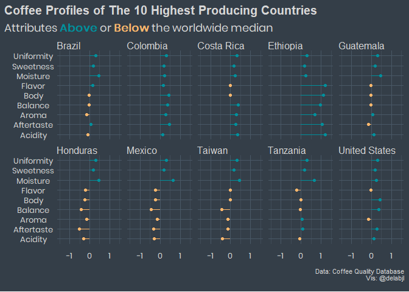

Coffee Ratings
================

## Fetching the data/setup

As always I begin by fetching the data from the tidytuesday repo. \#\#\#
Packages: These are the package I plan on using today:

  - tidyverse (It’s what this is all about)
  - ggtext (A wonderful package by
    \[@ClausWilke\](<https://twitter.com/ClausWilke>) that enables
    better control over text rendering)
  - patchwork (By the amazing
    \[@thomasp85\](<https://twitter.com/thomasp85>) allows for easy
    combining of plots)
  - janitor (makes it easy to clean the names of a data set.)
  - forcats (easy work with factors)
  - delabj (A personal package that includes a few tweaks to ggplot, and
    custom themes on github use
    devtools::install\_github(“delabj/delabj”) to install)
  - wesanderson has some interesting color palettes

Let’s take a look at the data. I see there’s a unit of measurement
column. Will this be something I need to convert?

``` r
summary(coffee_ratings)
```

    ##  total_cup_points   species             owner           country_of_origin 
    ##  Min.   : 0.00    Length:1339        Length:1339        Length:1339       
    ##  1st Qu.:81.08    Class :character   Class :character   Class :character  
    ##  Median :82.50    Mode  :character   Mode  :character   Mode  :character  
    ##  Mean   :82.09                                                            
    ##  3rd Qu.:83.67                                                            
    ##  Max.   :90.58                                                            
    ##                                                                           
    ##   farm_name          lot_number            mill            ico_number       
    ##  Length:1339        Length:1339        Length:1339        Length:1339       
    ##  Class :character   Class :character   Class :character   Class :character  
    ##  Mode  :character   Mode  :character   Mode  :character   Mode  :character  
    ##                                                                             
    ##                                                                             
    ##                                                                             
    ##                                                                             
    ##    company            altitude            region            producer        
    ##  Length:1339        Length:1339        Length:1339        Length:1339       
    ##  Class :character   Class :character   Class :character   Class :character  
    ##  Mode  :character   Mode  :character   Mode  :character   Mode  :character  
    ##                                                                             
    ##                                                                             
    ##                                                                             
    ##                                                                             
    ##  number_of_bags    bag_weight        in_country_partner harvest_year      
    ##  Min.   :   0.0   Length:1339        Length:1339        Length:1339       
    ##  1st Qu.:  14.0   Class :character   Class :character   Class :character  
    ##  Median : 175.0   Mode  :character   Mode  :character   Mode  :character  
    ##  Mean   : 154.2                                                           
    ##  3rd Qu.: 275.0                                                           
    ##  Max.   :1062.0                                                           
    ##                                                                           
    ##  grading_date         owner_1            variety          processing_method 
    ##  Length:1339        Length:1339        Length:1339        Length:1339       
    ##  Class :character   Class :character   Class :character   Class :character  
    ##  Mode  :character   Mode  :character   Mode  :character   Mode  :character  
    ##                                                                             
    ##                                                                             
    ##                                                                             
    ##                                                                             
    ##      aroma           flavor       aftertaste       acidity           body      
    ##  Min.   :0.000   Min.   :0.00   Min.   :0.000   Min.   :0.000   Min.   :0.000  
    ##  1st Qu.:7.420   1st Qu.:7.33   1st Qu.:7.250   1st Qu.:7.330   1st Qu.:7.330  
    ##  Median :7.580   Median :7.58   Median :7.420   Median :7.580   Median :7.500  
    ##  Mean   :7.567   Mean   :7.52   Mean   :7.401   Mean   :7.536   Mean   :7.517  
    ##  3rd Qu.:7.750   3rd Qu.:7.75   3rd Qu.:7.580   3rd Qu.:7.750   3rd Qu.:7.670  
    ##  Max.   :8.750   Max.   :8.83   Max.   :8.670   Max.   :8.750   Max.   :8.580  
    ##                                                                                
    ##     balance        uniformity       clean_cup        sweetness     
    ##  Min.   :0.000   Min.   : 0.000   Min.   : 0.000   Min.   : 0.000  
    ##  1st Qu.:7.330   1st Qu.:10.000   1st Qu.:10.000   1st Qu.:10.000  
    ##  Median :7.500   Median :10.000   Median :10.000   Median :10.000  
    ##  Mean   :7.518   Mean   : 9.835   Mean   : 9.835   Mean   : 9.857  
    ##  3rd Qu.:7.750   3rd Qu.:10.000   3rd Qu.:10.000   3rd Qu.:10.000  
    ##  Max.   :8.750   Max.   :10.000   Max.   :10.000   Max.   :10.000  
    ##                                                                    
    ##  cupper_points       moisture       category_one_defects    quakers       
    ##  Min.   : 0.000   Min.   :0.00000   Min.   : 0.0000      Min.   : 0.0000  
    ##  1st Qu.: 7.250   1st Qu.:0.09000   1st Qu.: 0.0000      1st Qu.: 0.0000  
    ##  Median : 7.500   Median :0.11000   Median : 0.0000      Median : 0.0000  
    ##  Mean   : 7.503   Mean   :0.08838   Mean   : 0.4795      Mean   : 0.1734  
    ##  3rd Qu.: 7.750   3rd Qu.:0.12000   3rd Qu.: 0.0000      3rd Qu.: 0.0000  
    ##  Max.   :10.000   Max.   :0.28000   Max.   :63.0000      Max.   :11.0000  
    ##                                                          NA's   :1        
    ##     color           category_two_defects  expiration        certification_body
    ##  Length:1339        Min.   : 0.000       Length:1339        Length:1339       
    ##  Class :character   1st Qu.: 0.000       Class :character   Class :character  
    ##  Mode  :character   Median : 2.000       Mode  :character   Mode  :character  
    ##                     Mean   : 3.556                                            
    ##                     3rd Qu.: 4.000                                            
    ##                     Max.   :55.000                                            
    ##                                                                               
    ##  certification_address certification_contact unit_of_measurement
    ##  Length:1339           Length:1339           Length:1339        
    ##  Class :character      Class :character      Class :character   
    ##  Mode  :character      Mode  :character      Mode  :character   
    ##                                                                 
    ##                                                                 
    ##                                                                 
    ##                                                                 
    ##  altitude_low_meters altitude_high_meters altitude_mean_meters
    ##  Min.   :     1      Min.   :     1       Min.   :     1      
    ##  1st Qu.:  1100      1st Qu.:  1100       1st Qu.:  1100      
    ##  Median :  1311      Median :  1350       Median :  1311      
    ##  Mean   :  1751      Mean   :  1799       Mean   :  1775      
    ##  3rd Qu.:  1600      3rd Qu.:  1650       3rd Qu.:  1600      
    ##  Max.   :190164      Max.   :190164       Max.   :190164      
    ##  NA's   :230         NA's   :230          NA's   :230

``` r
glimpse(coffee_ratings)
```

    ## Rows: 1,339
    ## Columns: 43
    ## $ total_cup_points      <dbl> 90.58, 89.92, 89.75, 89.00, 88.83, 88.83, 88....
    ## $ species               <chr> "Arabica", "Arabica", "Arabica", "Arabica", "...
    ## $ owner                 <chr> "metad plc", "metad plc", "grounds for health...
    ## $ country_of_origin     <chr> "Ethiopia", "Ethiopia", "Guatemala", "Ethiopi...
    ## $ farm_name             <chr> "metad plc", "metad plc", "san marcos barranc...
    ## $ lot_number            <chr> NA, NA, NA, NA, NA, NA, NA, NA, NA, NA, NA, N...
    ## $ mill                  <chr> "metad plc", "metad plc", NA, "wolensu", "met...
    ## $ ico_number            <chr> "2014/2015", "2014/2015", NA, NA, "2014/2015"...
    ## $ company               <chr> "metad agricultural developmet plc", "metad a...
    ## $ altitude              <chr> "1950-2200", "1950-2200", "1600 - 1800 m", "1...
    ## $ region                <chr> "guji-hambela", "guji-hambela", NA, "oromia",...
    ## $ producer              <chr> "METAD PLC", "METAD PLC", NA, "Yidnekachew Da...
    ## $ number_of_bags        <dbl> 300, 300, 5, 320, 300, 100, 100, 300, 300, 50...
    ## $ bag_weight            <chr> "60 kg", "60 kg", "1", "60 kg", "60 kg", "30 ...
    ## $ in_country_partner    <chr> "METAD Agricultural Development plc", "METAD ...
    ## $ harvest_year          <chr> "2014", "2014", NA, "2014", "2014", "2013", "...
    ## $ grading_date          <chr> "April 4th, 2015", "April 4th, 2015", "May 31...
    ## $ owner_1               <chr> "metad plc", "metad plc", "Grounds for Health...
    ## $ variety               <chr> NA, "Other", "Bourbon", NA, "Other", NA, "Oth...
    ## $ processing_method     <chr> "Washed / Wet", "Washed / Wet", NA, "Natural ...
    ## $ aroma                 <dbl> 8.67, 8.75, 8.42, 8.17, 8.25, 8.58, 8.42, 8.2...
    ## $ flavor                <dbl> 8.83, 8.67, 8.50, 8.58, 8.50, 8.42, 8.50, 8.3...
    ## $ aftertaste            <dbl> 8.67, 8.50, 8.42, 8.42, 8.25, 8.42, 8.33, 8.5...
    ## $ acidity               <dbl> 8.75, 8.58, 8.42, 8.42, 8.50, 8.50, 8.50, 8.4...
    ## $ body                  <dbl> 8.50, 8.42, 8.33, 8.50, 8.42, 8.25, 8.25, 8.3...
    ## $ balance               <dbl> 8.42, 8.42, 8.42, 8.25, 8.33, 8.33, 8.25, 8.5...
    ## $ uniformity            <dbl> 10.00, 10.00, 10.00, 10.00, 10.00, 10.00, 10....
    ## $ clean_cup             <dbl> 10, 10, 10, 10, 10, 10, 10, 10, 10, 10, 10, 1...
    ## $ sweetness             <dbl> 10.00, 10.00, 10.00, 10.00, 10.00, 10.00, 10....
    ## $ cupper_points         <dbl> 8.75, 8.58, 9.25, 8.67, 8.58, 8.33, 8.50, 9.0...
    ## $ moisture              <dbl> 0.12, 0.12, 0.00, 0.11, 0.12, 0.11, 0.11, 0.0...
    ## $ category_one_defects  <dbl> 0, 0, 0, 0, 0, 0, 0, 0, 0, 0, 0, 0, 0, 0, 0, ...
    ## $ quakers               <dbl> 0, 0, 0, 0, 0, 0, 0, 0, 0, 0, 0, 0, 0, 0, 0, ...
    ## $ color                 <chr> "Green", "Green", NA, "Green", "Green", "Blui...
    ## $ category_two_defects  <dbl> 0, 1, 0, 2, 2, 1, 0, 0, 0, 4, 1, 0, 0, 2, 2, ...
    ## $ expiration            <chr> "April 3rd, 2016", "April 3rd, 2016", "May 31...
    ## $ certification_body    <chr> "METAD Agricultural Development plc", "METAD ...
    ## $ certification_address <chr> "309fcf77415a3661ae83e027f7e5f05dad786e44", "...
    ## $ certification_contact <chr> "19fef5a731de2db57d16da10287413f5f99bc2dd", "...
    ## $ unit_of_measurement   <chr> "m", "m", "m", "m", "m", "m", "m", "m", "m", ...
    ## $ altitude_low_meters   <dbl> 1950.0, 1950.0, 1600.0, 1800.0, 1950.0, NA, N...
    ## $ altitude_high_meters  <dbl> 2200.0, 2200.0, 1800.0, 2200.0, 2200.0, NA, N...
    ## $ altitude_mean_meters  <dbl> 2075.0, 2075.0, 1700.0, 2000.0, 2075.0, NA, N...

``` r
coffee_ratings %>%
  ggplot(aes(x=unit_of_measurement))+
  geom_bar()
```

<!-- -->

``` r
coffee_ratings %>%
  ggplot(aes(y=country_of_origin))+
  geom_bar()
```

<!-- -->

``` r
coffee_ratings %>%
  mutate(certification_body = tolower(trimws(certification_body))) %>%
  ggplot(aes(y=certification_body))+
  geom_bar()
```

<!-- -->

``` r
coffee_ratings %>%
  mutate(in_country_partner = tolower(trimws(in_country_partner))) %>%
  ggplot(aes(y=in_country_partner))+
  geom_bar()
```

<!-- -->

``` r
coffee_ratings %>%
  mutate(in_country_partner = tolower(trimws(in_country_partner))) %>%
  ggplot(aes(y=in_country_partner))+
  geom_bar()
```

<!-- -->

``` r
coffee_ratings_cleaned <- coffee_ratings %>%
  mutate(certification_body = tolower(trimws(certification_body))) %>%
  mutate(in_country_partner = tolower(trimws(in_country_partner))) %>%
  mutate(harvest_year = gsub("[^[:digit:].]", "",  harvest_year),
         harvest_year = str_extract(harvest_year, "^.{4}")) %>%
  mutate(country_of_origin = case_when(
    str_detect(country_of_origin, "United States") ~  "United States", 
    str_detect(country_of_origin, "Tanzania") ~  "Tanzania", 
    TRUE ~ country_of_origin
  ))
```

It does look like the altitude has already been converted\!

I see a few quality columns, This sort of makes me think about maybe
doing a parallel coords plot.

``` r
df_par <- coffee_ratings_cleaned %>%
   transmute(
     country_of_origin,
        species, 
    processing_method,
     total_cup_points, 
     species, 
     processing_method,
     Aroma = scale(aroma), 
     Acidity = scale(acidity), 
     Aftertaste = scale(aftertaste), 
     Balance = scale(balance), 
     Body = scale(body),
     Flavor = scale(flavor), 
     Moisture = scale(moisture), 
     Sweetness = scale(sweetness),
     Uniformity = scale(uniformity)
         ) %>%
  
  mutate(row_num = row_number()) %>% 
  na.omit() %>%
  pivot_longer(Aroma:Uniformity, names_to = "measure",  values_to = "value") %>%
  filter(measure != "moisture") 


df_par %>%
  ggplot(aes(x=measure, y=value, color = species, group = row_num)) +
  geom_line( size = .5, alpha = .5)+
  theme_minimal()+
  scale_color_delabj()
```

<!-- -->

``` r
df_par %>%
  ggplot(aes(x=measure, y=value, color = processing_method, group = row_num)) +
  geom_line( size = .5, alpha = .5)+
  theme_minimal()+
  scale_color_delabj()
```

<!-- --> I’m not
particularly liking this. There seems to be a lot of similarities
between the species and the processing methods even standardizing the
values didn’t help much.

``` r
coffee_ratings %>% 
  select(
    total_cup_points, 
    species, 
    processing_method,
    aroma:moisture
         ) %>%
  summary()
```

    ##  total_cup_points   species          processing_method      aroma      
    ##  Min.   : 0.00    Length:1339        Length:1339        Min.   :0.000  
    ##  1st Qu.:81.08    Class :character   Class :character   1st Qu.:7.420  
    ##  Median :82.50    Mode  :character   Mode  :character   Median :7.580  
    ##  Mean   :82.09                                          Mean   :7.567  
    ##  3rd Qu.:83.67                                          3rd Qu.:7.750  
    ##  Max.   :90.58                                          Max.   :8.750  
    ##      flavor       aftertaste       acidity           body          balance     
    ##  Min.   :0.00   Min.   :0.000   Min.   :0.000   Min.   :0.000   Min.   :0.000  
    ##  1st Qu.:7.33   1st Qu.:7.250   1st Qu.:7.330   1st Qu.:7.330   1st Qu.:7.330  
    ##  Median :7.58   Median :7.420   Median :7.580   Median :7.500   Median :7.500  
    ##  Mean   :7.52   Mean   :7.401   Mean   :7.536   Mean   :7.517   Mean   :7.518  
    ##  3rd Qu.:7.75   3rd Qu.:7.580   3rd Qu.:7.750   3rd Qu.:7.670   3rd Qu.:7.750  
    ##  Max.   :8.83   Max.   :8.670   Max.   :8.750   Max.   :8.580   Max.   :8.750  
    ##    uniformity       clean_cup        sweetness      cupper_points   
    ##  Min.   : 0.000   Min.   : 0.000   Min.   : 0.000   Min.   : 0.000  
    ##  1st Qu.:10.000   1st Qu.:10.000   1st Qu.:10.000   1st Qu.: 7.250  
    ##  Median :10.000   Median :10.000   Median :10.000   Median : 7.500  
    ##  Mean   : 9.835   Mean   : 9.835   Mean   : 9.857   Mean   : 7.503  
    ##  3rd Qu.:10.000   3rd Qu.:10.000   3rd Qu.:10.000   3rd Qu.: 7.750  
    ##  Max.   :10.000   Max.   :10.000   Max.   :10.000   Max.   :10.000  
    ##     moisture      
    ##  Min.   :0.00000  
    ##  1st Qu.:0.09000  
    ##  Median :0.11000  
    ##  Mean   :0.08838  
    ##  3rd Qu.:0.12000  
    ##  Max.   :0.28000

``` r
coffee_ratings %>% 
  select(
    total_cup_points, 
    species, 
    aroma:moisture
         ) %>%
  na.omit() %>%
  ggplot(aes(x= moisture, y=sweetness , color = species))+
  geom_jitter()+
  geom_density2d()
```

    ## Warning: Computation failed in `stat_density2d()`:
    ## bandwidths must be strictly positive

<!-- -->

It looks like at least from a 2d perspective that there’s not much of a
clear separation in species except in sweetness, where Robusta makes up
a narrow band in the middle. I might just try to look at a few of the
attributes using a raincloud plot?

``` r
# Taken from https://micahallen.org/2018/03/15/introducing-raincloud-plots/
"%||%" <- function(a, b) {
  if (!is.null(a)) a else b
}

geom_flat_violin <- function(mapping = NULL, data = NULL, stat = "ydensity",
                             position = "dodge", trim = TRUE, scale = "area",
                             show.legend = NA, inherit.aes = TRUE, ...) {
  layer(
    data = data,
    mapping = mapping,
    stat = stat,
    geom = GeomFlatViolin,
    position = position,
    show.legend = show.legend,
    inherit.aes = inherit.aes,
    params = list(
      trim = trim,
      scale = scale,
      ...
    )
  )
}

#' @rdname ggplot2-ggproto
#' @format NULL
#' @usage NULL
#' @export
GeomFlatViolin <-
  ggproto("GeomFlatViolin", Geom,
    setup_data = function(data, params) {
      data$width <- data$width %||%
        params$width %||% (resolution(data$x, FALSE) * 0.9)

      # ymin, ymax, xmin, and xmax define the bounding rectangle for each group
      data %>%
        group_by(group) %>%
        mutate(
          ymin = min(y),
          ymax = max(y),
          xmin = x,
          xmax = x + width / 2
        )
    },

    draw_group = function(data, panel_scales, coord) {
      # Find the points for the line to go all the way around
      data <- transform(data,
        xminv = x,
        xmaxv = x + violinwidth * (xmax - x)
      )

      # Make sure it's sorted properly to draw the outline
      newdata <- rbind(
        plyr::arrange(transform(data, x = xminv), y),
        plyr::arrange(transform(data, x = xmaxv), -y)
      )

      # Close the polygon: set first and last point the same
      # Needed for coord_polar and such
      newdata <- rbind(newdata, newdata[1, ])

      ggplot2:::ggname("geom_flat_violin", GeomPolygon$draw_panel(newdata, panel_scales, coord))
    },

    draw_key = draw_key_polygon,

    default_aes = aes(
      weight = 1, colour = "grey20", fill = "white", size = 0.5,
      alpha = NA, linetype = "solid"
    ),

    required_aes = c("x", "y")
  )
```

``` r
rain_df <-  coffee_ratings_cleaned %>%
   select(
     species, 
     processing_method,
     aroma:moisture
         ) %>%
  mutate(row_num = row_number()) %>% 
  pivot_longer(aroma:moisture, names_to = "measure",  values_to = "value") %>%
  filter(measure != "moisture") 


rain_df %>%
  na.omit() %>%
  filter( measure %!in% c("uniformity", "sweetness", "clean_cup", "cupper_points")) %>%
  ggplot(aes(y = value, x = measure, fill = measure))+
  facet_wrap(~species)+
  geom_flat_violin(position = position_nudge(x = .2, y = 0), alpha = .8, color = "#696969") +
  geom_point(aes( color = measure), position = position_jitter(width = .15), size = .5, alpha = 0.5)+
  geom_boxplot(width = .1, guides = FALSE, outlier.shape = NA, alpha = 0.5, color = "#696969")+
  coord_flip()+
  labs(title = "How do you take it?",
       subtitle = "Distribution of Coffee Profile by species", 
       x=NULL, 
       y=NULL, 
       caption = "Data: Coffee Quality Database\nVis: @delabjl")+
  theme_delabj_dark()+
  legend_none()+
  scale_fill_delabj()+
  scale_color_delabj()+
  theme(strip.background = element_blank(),
        plot.subtitle = element_markdown(), 
        plot.caption = element_text(size = 8))
```

    ## Warning: Ignoring unknown parameters: guides

<!-- -->

``` r
ggsave("coffee_cloud.png", dpi = 320, height = 5, width = 10, type = "cairo")
```

I don’t hate the plot, but it’s not very interesting imo. I’m still not
100% sure how useful raincloud plots are over violin plots/barplots, or
scatter plots.

What about a profile by country or region? I could look at the profile
by the top 10 or so countries to see if there’s a difference there.

``` r
top_10_countries<- coffee_ratings_cleaned %>% 
  count(country_of_origin, sort = TRUE) %>%
  head(10) %>%
  pull(country_of_origin)

coffee_ratings_cleaned %>%
  filter(country_of_origin %in% top_10_countries
         ) %>%
   transmute(
     country_of_origin,
     total_cup_points, 
     species, 
     processing_method,
     Aroma = scale(aroma), 
     Acidity = scale(acidity), 
     Aftertaste = scale(aftertaste), 
     Balance = scale(balance), 
     Body = scale(body),
     Flavor = scale(flavor), 
     Moisture = scale(moisture), 
     Sweetness = scale(sweetness),
     Uniformity = scale(uniformity)
         ) %>%
  na.omit() %>%
  pivot_longer(Aroma:Uniformity, names_to = "measure",  values_to = "value") %>%
  group_by(country_of_origin, measure) %>%
  summarise( median_val = median(value, na.rm = TRUE)) %>%
  mutate(color = if_else(median_val >=0, "Positive", "negative")) %>%
  ggplot(aes(y=measure, x = median_val, color = color))+
  facet_wrap(~country_of_origin, nrow = 2)+
  geom_segment(aes(x= 0,y=measure, xend = median_val, yend = measure))+
  geom_point()+
  labs(
    title = "Coffee Profiles of The 10 Highest Producing Countries",
    subtitle = "Attributes <b style = 'color: #008F9B'>Above</b> or <b style = 'color:#FCB76D'>Below</b> the worldwide median", 
    y=NULL,
    x=NULL,
    caption = "Data: Coffee Quality Database\nVis: @delabjl"
  )+
  xlim(-1.5,1.5)+
  theme_delabj_dark()+
  scale_color_delabj("retro")+
  theme(strip.background = element_blank(),
        plot.subtitle = element_markdown(), 
        plot.caption = element_text(size = 8))+
  legend_none()
```

    ## `summarise()` regrouping output by 'country_of_origin' (override with `.groups` argument)

<!-- -->

``` r
ggsave("top_10_profile.png", dpi = 320, height = 5, width = 10, type = "cairo")
```
