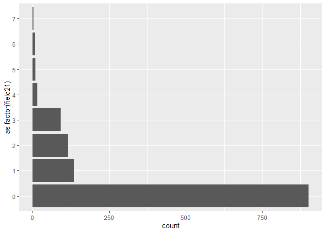
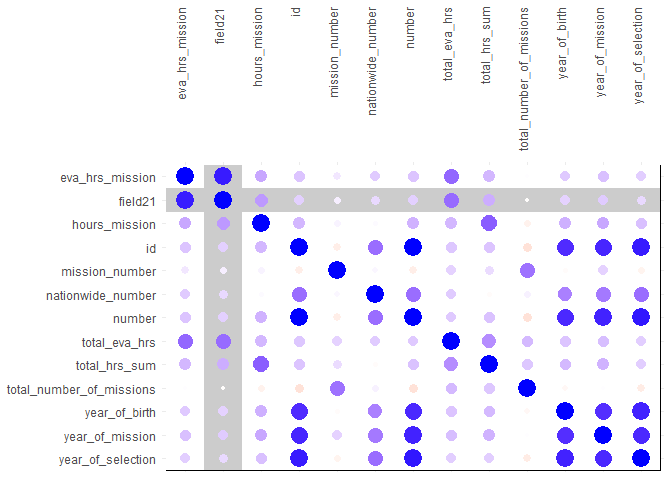

Spaaaaaacccccceeeeee
================
Joshua de la Bruere
7/14/2020

## Fetching the data/setup

As always I begin by fetching the data from the tidytuesday repo. \#\#\#
Packages: These are the package I plan on using today:

  - tidyverse (It’s what this is all about)
  - ggtext (A wonderful package by
    \[@ClausWilke\](<https://twitter.com/ClausWilke>) that enables
    better control over text rendering)
  - patchwork (By the amazing
    \[@thomasp85\](<https://twitter.com/thomasp85>) allows for easy
    combining of plots)
  - janitor (makes it easy to clean the names of a data set.)
  - forcats (easy work with factors)
  - delabj (A personal package that includes a few tweaks to ggplot, and
    custom themes on github use
    devtools::install\_github(“delabj/delabj”) to install)

This weeks data is about space\! Let’s take a look at what’s in the
astronauts database. I’m curious as to what field21 is

``` r
glimpse(astronauts)
```

    ## Rows: 1,277
    ## Columns: 24
    ## $ id                       <dbl> 1, 2, 3, 4, 5, 6, 7, 8, 9, 10, 11, 12, 13,...
    ## $ number                   <dbl> 1, 2, 3, 3, 4, 5, 5, 6, 6, 7, 7, 7, 8, 8, ...
    ## $ nationwide_number        <dbl> 1, 2, 1, 1, 2, 2, 2, 4, 4, 3, 3, 3, 4, 4, ...
    ## $ name                     <chr> "Gagarin, Yuri", "Titov, Gherman", "Glenn,...
    ## $ original_name            <chr> "<U+0413><U+0410><U+0413><U+0410><U+0420><U+0418><U+041D> <U+042E><U+0440><U+0438><U+0439> <U+0410><U+043B><U+0435><U+043A><U+0441><U+0435><U+0435><U+0432><U+0438><U+0447>", "<U+0422><U+0418><U+0422><U+041E><U+0412> <U+0413><U+0435><U+0440><U+043C><U+0430><U+043D> <U+0421>...
    ## $ sex                      <chr> "male", "male", "male", "male", "male", "m...
    ## $ year_of_birth            <dbl> 1934, 1935, 1921, 1921, 1925, 1929, 1929, ...
    ## $ nationality              <chr> "U.S.S.R/Russia", "U.S.S.R/Russia", "U.S."...
    ## $ military_civilian        <chr> "military", "military", "military", "milit...
    ## $ selection                <chr> "TsPK-1", "TsPK-1", "NASA Astronaut Group ...
    ## $ year_of_selection        <dbl> 1960, 1960, 1959, 1959, 1959, 1960, 1960, ...
    ## $ mission_number           <dbl> 1, 1, 1, 2, 1, 1, 2, 1, 2, 1, 2, 3, 1, 2, ...
    ## $ total_number_of_missions <dbl> 1, 1, 2, 2, 1, 2, 2, 2, 2, 3, 3, 3, 2, 2, ...
    ## $ occupation               <chr> "pilot", "pilot", "pilot", "PSP", "Pilot",...
    ## $ year_of_mission          <dbl> 1961, 1961, 1962, 1998, 1962, 1962, 1970, ...
    ## $ mission_title            <chr> "Vostok 1", "Vostok 2", "MA-6", "STS-95", ...
    ## $ ascend_shuttle           <chr> "Vostok 1", "Vostok 2", "MA-6", "STS-95", ...
    ## $ in_orbit                 <chr> "Vostok 2", "Vostok 2", "MA-6", "STS-95", ...
    ## $ descend_shuttle          <chr> "Vostok 3", "Vostok 2", "MA-6", "STS-95", ...
    ## $ hours_mission            <dbl> 1.77, 25.00, 5.00, 213.00, 5.00, 94.00, 42...
    ## $ total_hrs_sum            <dbl> 1.77, 25.30, 218.00, 218.00, 5.00, 519.33,...
    ## $ field21                  <dbl> 0, 0, 0, 0, 0, 0, 0, 0, 0, 0, 0, 0, 0, 0, ...
    ## $ eva_hrs_mission          <dbl> 0.00, 0.00, 0.00, 0.00, 0.00, 0.00, 0.00, ...
    ## $ total_eva_hrs            <dbl> 0.00, 0.00, 0.00, 0.00, 0.00, 0.00, 0.00, ...

``` r
# what is field 21? 
astronauts$field21 %>% summary()
```

    ##    Min. 1st Qu.  Median    Mean 3rd Qu.    Max. 
    ##  0.0000  0.0000  0.0000  0.6288  1.0000  7.0000

``` r
astronauts %>% 
  ggplot(aes(y= as.factor(field21)))+
  geom_bar()
```

<!-- -->

``` r
astronauts %>%
  select_if(is.numeric) %>%
  cor() %>%
  round(2) %>%
  data.frame() %>%
  rownames_to_column() %>%
  pivot_longer(cols= id:total_eva_hrs, names_to = "columnname", values_to = "correlation") %>%
  mutate(
    highlight_cell = if_else(rowname == "field21", TRUE, if_else(columnname == "field21", TRUE, FALSE)),
         ) %>%
  ggplot(aes(x=rowname, y=fct_rev(columnname)))+
  geom_tile(fill= "white", color = "black")+
  geom_tile(aes(fill = highlight_cell ))+
  geom_point(aes(size= abs(correlation), color = correlation))+
  scale_color_gradient2(low= "red", high = "blue", mid = "white")+
  scale_fill_manual(values= c("white", "grey80"))+
  scale_x_discrete(position = "top") +
  labs(
    x=NULL,
    y=NULL

  )+
  guides(color= guide_colorbar(),
         size = NULL)+
  theme_minimal()+
  theme(axis.text.x = element_text(angle =  90, hjust = 1))+
  legend_none()
```

<!-- -->

``` r
ggsave("correlation.png", height = 10, width = 10, type="cairo")
```

I think that field21 might be related to eva. Perhaps it’s the number of
times they had an eva on that mission?

(I did some digging and found the following text in the paper) \>The
following information was included: 1) identification (official and
Romanised name, national database ID number, and retirement status); 2)
demographics (nationality, sex, year of birth, year of selection, and
military background); 3) career statistics (total time spent in space,
number of flights, and extra-vehicular activity (EVA) hours); and 4)
data on each mission involving the traveler (the name, year, and
duration of each mission; ascent/orbit/descent vehicle; and instances of
and total EVA time per mission).
