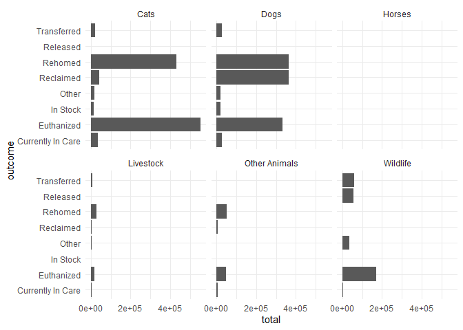
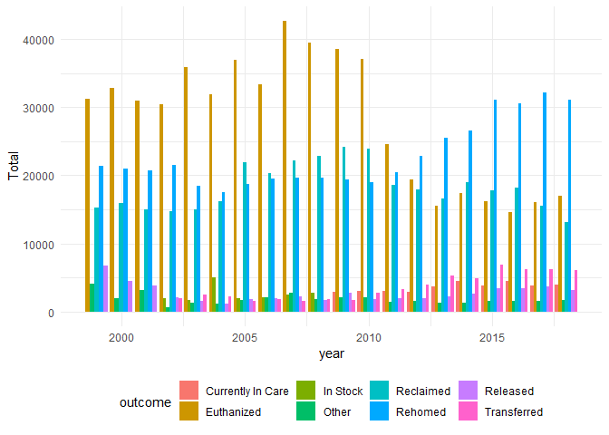

Australian Pets
================
Joshua de la Bruere
7/21/2020

## Fetching the data/setup

As always I begin by fetching the data from the tidytuesday repo. \#\#\#
Packages: These are the package I plan on using today:

  - tidyverse (It’s what this is all about)
  - ggtext (A wonderful package by
    \[@ClausWilke\](<https://twitter.com/ClausWilke>) that enables
    better control over text rendering)
  - patchwork (By the amazing
    \[@thomasp85\](<https://twitter.com/thomasp85>) allows for easy
    combining of plots)
  - janitor (makes it easy to clean the names of a data set.)
  - forcats (easy work with factors)
  - delabj (A personal package that includes a few tweaks to ggplot, and
    custom themes on github use
    devtools::install\_github(“delabj/delabj”) to install)

I will start by doing some basic EDA to figure out if there’s any
cleaning that needs to be done or not. I want to play with the \`%T\>%
operator to see if I can combine my standard summary/glipse starting
point.

``` r
animal_complaints %T>%
  glimpse() %>%
  mutate(across(where(is.character), as.factor)) %>%
  summary()
```

    ## Rows: 42,413
    ## Columns: 5
    ## $ `Animal Type`        <chr> "dog", "dog", "dog", "dog", "dog", "dog", "dog...
    ## $ `Complaint Type`     <chr> "Aggressive Animal", "Noise", "Noise", "Privat...
    ## $ `Date Received`      <chr> "June 2020", "June 2020", "June 2020", "June 2...
    ## $ Suburb               <chr> "Alice River", "Alice River", "Alice River", "...
    ## $ `Electoral Division` <chr> "Division 1", "Division 1", "Division 1", "Div...

    ##  Animal Type           Complaint Type      Date Received           Suburb     
    ##  cat: 4094   Aggressive Animal: 4459   August 2016:  761   Unallocated: 4934  
    ##  dog:38319   Attack           : 3836   May 2017   :  719   Kirwan     : 3713  
    ##              Enclosure        : 6282   June 2017  :  711   Kelso      : 3296  
    ##              Noise            : 9205   July 2017  :  707   Aitkenvale : 2147  
    ##              Private Impound  :12692   July 2016  :  700   Douglas    : 1837  
    ##              Wandering        : 5939   June 2016  :  688   Condon     : 1614  
    ##                                        (Other)    :38127   (Other)    :24872  
    ##    Electoral Division
    ##  Division 4 : 5610   
    ##  Unallocated: 5568   
    ##  Division 8 : 5236   
    ##  Division 2 : 4314   
    ##  Division 7 : 3563   
    ##  Division 9 : 3380   
    ##  (Other)    :14742

``` r
animal_outcomes %T>%
  glimpse() %>%
  mutate(across(where(is.character), as.factor)) %>%
  summary()
```

    ## Rows: 664
    ## Columns: 12
    ## $ year        <dbl> 1999, 1999, 1999, 1999, 1999, 1999, 1999, 1999, 1999, 1...
    ## $ animal_type <chr> "Dogs", "Dogs", "Dogs", "Dogs", "Cats", "Cats", "Cats",...
    ## $ outcome     <chr> "Reclaimed", "Rehomed", "Other", "Euthanized", "Reclaim...
    ## $ ACT         <dbl> 610, 1245, 12, 360, 111, 1442, 0, 1007, 0, 1, 0, 0, 2, ...
    ## $ NSW         <dbl> 3140, 7525, 745, 9221, 201, 3913, 447, 8205, 0, 12, 0, ...
    ## $ NT          <dbl> 205, 526, 955, 9, 22, 269, 0, 847, 1, 3, 0, 0, 0, 120, ...
    ## $ QLD         <dbl> 1392, 5489, 860, 9214, 206, 3901, 386, 10554, 0, 3, 11,...
    ## $ SA          <dbl> 2329, 1105, 380, 1701, 157, 1055, 46, 3415, 2, 10, 1, 0...
    ## $ TAS         <dbl> 516, 480, 168, 599, 31, 752, 124, 1056, 1, 0, 2, 0, 1, ...
    ## $ VIC         <dbl> 7130, 4908, 1001, 5217, 884, 3768, 1501, 6113, 87, 19, ...
    ## $ WA          <dbl> 1, 137, 6, 18, 0, 62, 5, 5, 0, 0, 0, 0, 0, 3, 0, 0, 0, ...
    ## $ Total       <dbl> 15323, 21415, 4127, 26339, 1612, 15162, 2509, 31202, 91...

    ##       year             animal_type               outcome         ACT        
    ##  Min.   :1999   Cats         :114   Euthanized       :120   Min.   :   0.0  
    ##  1st Qu.:2004   Dogs         :114   Other            :120   1st Qu.:   1.0  
    ##  Median :2009   Horses       :114   Transferred      :102   Median :  36.0  
    ##  Mean   :2009   Livestock    :114   Reclaimed        :100   Mean   : 201.9  
    ##  3rd Qu.:2014   Other Animals:114   Rehomed          :100   3rd Qu.: 191.0  
    ##  Max.   :2018   Wildlife     : 94   Currently In Care: 60   Max.   :1628.0  
    ##                                     (Other)          : 62                   
    ##       NSW                NT              QLD                SA        
    ##  Min.   :    0.0   Min.   :   0.0   Min.   :    0.0   Min.   :   0.0  
    ##  1st Qu.:    9.0   1st Qu.:   0.0   1st Qu.:   15.0   1st Qu.:   2.0  
    ##  Median :   78.5   Median :   1.0   Median :  198.5   Median :  34.5  
    ##  Mean   :  970.6   Mean   : 210.8   Mean   : 1289.9   Mean   : 318.3  
    ##  3rd Qu.:  514.8   3rd Qu.:  60.0   3rd Qu.:  854.0   3rd Qu.: 226.8  
    ##  Max.   :13267.0   Max.   :8150.0   Max.   :15690.0   Max.   :4252.0  
    ##                    NA's   :11                         NA's   :2       
    ##       TAS              VIC                 WA              Total      
    ##  Min.   :   0.0   Min.   :    0.00   Min.   :   0.00   Min.   :    0  
    ##  1st Qu.:   3.0   1st Qu.:   13.75   1st Qu.:   0.00   1st Qu.:  162  
    ##  Median :  21.0   Median :  108.50   Median :   2.00   Median : 1015  
    ##  Mean   : 141.3   Mean   :  992.26   Mean   :  88.47   Mean   : 4199  
    ##  3rd Qu.:  96.0   3rd Qu.:  680.75   3rd Qu.:  46.25   3rd Qu.: 2839  
    ##  Max.   :1974.0   Max.   :10567.00   Max.   :6035.00   Max.   :42731  
    ##  NA's   :1                                             NA's   :3

``` r
brisbane_complaints %T>%
  glimpse() %>%
  mutate(across(where(is.character), as.factor)) %>%
  summary()
```

    ## Rows: 31,330
    ## Columns: 7
    ## $ nature             <chr> "Animal", "Animal", "Animal", "Animal", "Animal"...
    ## $ animal_type        <chr> "Dog", "Dog", "Dog", "Dog", "Attack", "Attack", ...
    ## $ category           <chr> "Fencing Issues", "Fencing Issues", "Defecating ...
    ## $ suburb             <chr> "SUNNYBANK", "SUNNYBANK HILLS", "SUNNYBANK", "SU...
    ## $ date_range         <chr> "1st-quarter-2016-17.csv", "1st-quarter-2016-17....
    ## $ responsible_office <lgl> NA, NA, NA, NA, NA, NA, NA, NA, NA, NA, NA, NA, ...
    ## $ city               <chr> "Brisbane", "Brisbane", "Brisbane", "Brisbane", ...

    ##     nature            animal_type                   category   
    ##  Animal:31330   Attack      : 8539   Fencing Issues     :5490  
    ##                 Cat         : 2070   Wandering          :4250  
    ##                 Cat Trapping: 2675   Attack On An Animal:3039  
    ##                 Dog         :13334   Attack On A Person :2221  
    ##                 Other Animal: 4712   Unregistered       :2025  
    ##                                      (Other)            :8626  
    ##                                      NA's               :5679  
    ##            suburb     
    ##  INALA        : 1053  
    ##  BRACKEN RIDGE:  600  
    ##  WYNNUM       :  575  
    ##  FOREST LAKE  :  542  
    ##  ACACIA RIDGE :  434  
    ##  (Other)      :27818  
    ##  NA's         :  308  
    ##                                                              date_range   
    ##  cars-srsa-open-data-animal-related-complaints-apr-to-jun-2020.csv: 2799  
    ##  cars-srsa-open-data-animal-related-complaints-jan-to-mar-2020.csv: 2146  
    ##  jul-to-sep-2019.csv                                              : 2143  
    ##  jul-to-sep-2018.csv                                              : 2101  
    ##  oct-to-dec-2018.csv                                              : 1968  
    ##  apr-jun-2019.csv                                                 : 1954  
    ##  (Other)                                                          :18219  
    ##  responsible_office       city      
    ##  Mode:logical       Brisbane:31330  
    ##  NA's:31330                         
    ##                                     
    ##                                     
    ##                                     
    ##                                     
    ## 

How many types of compants are there? What about by animal

``` r
animal_complaints %>%
  group_by(`Animal Type`, `Complaint Type`) %>%
  count() %>%
  knitr::kable()
```

| Animal Type | Complaint Type    |    n |
| :---------- | :---------------- | ---: |
| cat         | Enclosure         |  610 |
| cat         | Private Impound   | 3046 |
| cat         | Wandering         |  438 |
| dog         | Aggressive Animal | 4459 |
| dog         | Attack            | 3836 |
| dog         | Enclosure         | 5672 |
| dog         | Noise             | 9205 |
| dog         | Private Impound   | 9646 |
| dog         | Wandering         | 5501 |

What about outcomes?

``` r
animal_outcomes %>%
  group_by(animal_type, outcome) %>%
  summarise(total = sum(Total)) %>%
  knitr::kable()
```

    ## `summarise()` regrouping output by 'animal_type' (override with `.groups` argument)

| animal\_type  | outcome           |  total |
| :------------ | :---------------- | -----: |
| Cats          | Currently In Care |  35646 |
| Cats          | Euthanized        | 553956 |
| Cats          | In Stock          |  14427 |
| Cats          | Other             |  17994 |
| Cats          | Reclaimed         |  41427 |
| Cats          | Rehomed           | 432448 |
| Cats          | Transferred       |  21629 |
| Dogs          | Currently In Care |  25653 |
| Dogs          | Euthanized        | 332547 |
| Dogs          | In Stock          |  17844 |
| Dogs          | Other             |  18532 |
| Dogs          | Reclaimed         | 364579 |
| Dogs          | Rehomed           | 362093 |
| Dogs          | Transferred       |  27065 |
| Horses        | Currently In Care |   1385 |
| Horses        | Euthanized        |    529 |
| Horses        | In Stock          |    269 |
| Horses        | Other             |     90 |
| Horses        | Reclaimed         |    577 |
| Horses        | Rehomed           |   1599 |
| Horses        | Transferred       |    305 |
| Livestock     | Currently In Care |   3300 |
| Livestock     | Euthanized        |  18210 |
| Livestock     | In Stock          |   1570 |
| Livestock     | Other             |   2696 |
| Livestock     | Reclaimed         |   3721 |
| Livestock     | Rehomed           |  26388 |
| Livestock     | Transferred       |   5338 |
| Other Animals | Currently In Care |   5752 |
| Other Animals | Euthanized        |  47888 |
| Other Animals | In Stock          |     NA |
| Other Animals | Other             |     NA |
| Other Animals | Reclaimed         |   5102 |
| Other Animals | Rehomed           |  49908 |
| Other Animals | Transferred       |     NA |
| Wildlife      | Currently In Care |   2913 |
| Wildlife      | Euthanized        | 171411 |
| Wildlife      | In Stock          |    952 |
| Wildlife      | Other             |  35000 |
| Wildlife      | Released          |  54265 |
| Wildlife      | Transferred       |  59692 |

``` r
animal_outcomes %>%
  group_by(animal_type, outcome) %>%
  summarise(total = sum(Total)) %>%
  ggplot(aes(y=outcome, x=total))+
  facet_wrap(~animal_type)+
  geom_bar(stat = "identity")+
  theme_minimal()
```

    ## `summarise()` regrouping output by 'animal_type' (override with `.groups` argument)

    ## Warning: Removed 3 rows containing missing values (position_stack).

<!-- -->

``` r
animal_outcomes %>%
  ggplot(aes(x=year, y=Total, fill = outcome))+
  geom_bar(stat = "identity", position = position_dodge())+
  theme_minimal()+
  legend_bottom()
```

    ## Warning: Removed 3 rows containing missing values (geom_bar).

<!-- -->

I’m not actually sure if I need to clean anything outright. I think I’ll
be lumping some categorical variables together to avoid having a lot of
options. I will pivot the outcomes longer and maybe replace the values.

``` r
region_names <- tribble(
~region_abb, ~region,
'ACT',  'Australian Capital Territory',
'NSW',  'New South Wales',
'NT',   'Northern Territory',
'QLD',  'Queensland',
'SA',   'South Australia',
'TAS',  'Tasmania',
'VIC',  'Victoria',
'WA',   'Western Australian'
)


animal_complaints %<>%
  janitor::clean_names()

outcomes_cleaned <- animal_outcomes %>%
  # I'm only interested in Cats and Dogs vs Others
  mutate(animal_type = case_when(
    str_detect(animal_type, "Cat") ~ "cat",
    str_detect(animal_type, "Dog") ~ "dog",
    TRUE ~ "other"
  )) %>% 
  pivot_longer(cols = ACT:WA, names_to = "region_abb", values_to = "number") %>%
  left_join(region_names)
```

    ## Joining, by = "region_abb"

I kinda want to maybe do a statebins style plot. I recently made a
pacakge for Africa countries, so I’m familiar with the code.

<details>

<summary> Setting Up statebins </summary>

``` r
geom_countrybins_africa <- function(
  mapping = NULL,
  data = NULL,
  border_col = "white",
  border_size = 2,
  lbl_size = 3,
  dark_lbl = "black",
  light_lbl = "white",
  radius = grid::unit(6, "pt"),
  ...,
  na.rm = FALSE,
  show.legend = NA,
  inherit.aes = TRUE){

  ggplot2::layer(
    data = data,
    mapping = mapping,
    stat = "identity",
    geom = GeomcountrybinsAfrica,
    position = "identity",
    show.legend = show.legend,
    inherit.aes = inherit.aes,
    params = list(
      border_col = border_col,
      border_size = border_size,
      lbl_size = lbl_size,
      dark_lbl = dark_lbl,
      light_lbl = light_lbl,
      radius = radius,
      na.rm = na.rm,
      ...
    )
  )
  }


#' @rdname geom_countrybins_africa
#' @export
GeomcountrybinsAfrica <- ggplot2::ggproto(
  "GeomcountrybinsAfrica", ggplot2::Geom,
  default_aes = ggplot2::aes(
    fill = "grey20",
    colour = NA,
    size = 0.1,
    linetype = 1,
    country = "country",
    label="abrv_3_letter",
    angle = 0,
    hjust = 0.5,
    vjust = 0.5,
    alpha = NA,
    family = "",
    fontface = 1,
    lineheight = 1.2
    ),
  extra_params = c(
    "na.rm",
    "width",
    "height"
    ),
  setup_data = function(
    data,
    params) {
    country_data <- data.frame(data, stringsAsFactors=FALSE)

    if (max(nchar(country_data[,"country"])) <= 2) {
      merge.x <- "abrv_2_letter"
    }
    else if (max(nchar(country_data[,"country"])) <= 3){
      merge.x <- "abrv_3_letter"
    }
    else {
      merge.x <- "country"
    }
    country_data <- validate_countries(country_data, "country", merge.x, ignore_dupes=TRUE)
    ctry.dat <- merge(b_country_coords,
                      country_data,
                      by.x=merge.x,
                      by.y="country",
                      all.y=TRUE,
                      sort=TRUE)

    ctry.dat$width  <- ctry.dat$width  %||% params$width  %||% ggplot2::resolution(ctry.dat$x, FALSE)
    ctry.dat$height <- ctry.dat$height %||% params$height %||% ggplot2::resolution(ctry.dat$y, FALSE)
    transform(ctry.dat,
              xmin = x - width / 2,
              xmax = x + width / 2,
              width = NULL,
              ymin = y - height / 2,
              ymax = y + height / 2,
              height = NULL
              ) -> xdat
    xdat
    },
  required_aes = c("country", "fill"),
  draw_panel = function(self, data,
                        panel_params,
                        coord,
                        border_col = "white",
                        border_size = 2,
                        lbl_size = 3,
                        dark_lbl = "black",
                        light_lbl = "white",
                        radius = grid::unit(6, "pt")) {
    tile_data <- data
    tile_data$colour <- border_col
    tile_data$size <- border_size

    text_data <- data
    text_data$label <- data$abrv_3_letter
    text_data$fill <- NA
    text_data$size <-  lbl_size
    text_data$colour <- .sb_invert(
      data$fill,
      dark_lbl,
      light_lbl
      )
    coord <- coord_equal()
    grid::gList(
      GeomRtile$draw_panel(tile_data, panel_params, coord, radius),
      ggplot2::GeomText$draw_panel(text_data, panel_params, coord)
      ) -> grobs
    ggname("geom_countrybins_africa", grid::grobTree(children = grobs))

    },
  draw_key = ggplot2::draw_key_polygon

)


geom_rrect <- function(mapping = NULL, data = NULL,
                       stat = "identity", position = "identity",
                       radius = grid::unit(6, "pt"),
                       ...,
                       na.rm = FALSE,
                       show.legend = NA,
                       inherit.aes = TRUE) {
  layer(
    data = data,
    mapping = mapping,
    stat = stat,
    geom = GeomRrect,
    position = position,
    show.legend = show.legend,
    inherit.aes = inherit.aes,
    params = list(
      radius = radius,
      na.rm = na.rm,
      ...
    )
  )
}

GeomRrect <- ggplot2::ggproto("GeomRrect", ggplot2::Geom,

                              default_aes = ggplot2::aes(
                                colour = NA, fill = "grey35", size = 0.5, linetype = 1, alpha = NA
                              ),

                              required_aes = c("xmin", "xmax", "ymin", "ymax"),

                              draw_panel = function(self, data, panel_params, coord,
                                                    radius = grid::unit(6, "pt")) {

                                coords <- coord$transform(data, panel_params)

                                lapply(1:length(coords$xmin), function(i) {

                                  grid::roundrectGrob(
                                    coords$xmin[i], coords$ymax[i],
                                    width = (coords$xmax[i] - coords$xmin[i]),
                                    height = (coords$ymax[i] - coords$ymin)[i],
                                    r = radius,
                                    default.units = "native",
                                    just = c("left", "top"),
                                    gp = grid::gpar(
                                      col = coords$colour[i],
                                      fill = alpha(coords$fill[i], coords$alpha[i]),
                                      lwd = coords$size[i] * .pt,
                                      lty = coords$linetype[i],
                                      lineend = "butt"
                                    )
                                  )

                                }) -> gl

                                grobs <- do.call(grid::gList, gl)

                                ggname("geom_rrect", grid::grobTree(children = grobs))

                              },

                              draw_key = ggplot2::draw_key_polygon

)

geom_rtile <- function(mapping = NULL, data = NULL,
                       stat = "identity", position = "identity",
                       radius = grid::unit(6, "pt"),
                       ...,
                       na.rm = FALSE,
                       show.legend = NA,
                       inherit.aes = TRUE) {
  ggplot2::layer(
    data = data,
    mapping = mapping,
    stat = stat,
    geom = GeomRtile,
    position = position,
    show.legend = show.legend,
    inherit.aes = inherit.aes,
    params = list(
      radius = radius,
      na.rm = na.rm,
      ...
    )
  )
}

GeomRtile <- ggplot2::ggproto("GeomRtile", GeomRrect,

                              extra_params = c("na.rm", "width", "height"),

                              setup_data = function(data, params) {
                                data$width <- data$width %||% params$width %||% ggplot2::resolution(data$x, FALSE)
                                data$height <- data$height %||% params$height %||% ggplot2::resolution(data$y, FALSE)

                                transform(data,
                                          xmin = x - width / 2,  xmax = x + width / 2,  width = NULL,
                                          ymin = y - height / 2, ymax = y + height / 2, height = NULL
                                )
                              },

                              default_aes = ggplot2::aes(
                                fill = "grey20", colour = NA, size = 0.1, linetype = 1, alpha = NA
                              ),

                              required_aes = c("x", "y"),

                              draw_key = ggplot2::draw_key_polygon

)
ggname <- function(prefix, grob) {
  grob$name <- grid::grobName(grob, prefix)
  grob
}


.sb_invert <- function(hex_color, dark_color="black", light_color="white",
                       na_color="white") {

  hex_color <- gsub("#", "", hex_color)

  R <- suppressWarnings(as.integer(paste("0x", substr(hex_color,1,2), sep="")))
  G <- suppressWarnings(as.integer(paste("0x", substr(hex_color,3,4), sep="")))
  B <- suppressWarnings(as.integer(paste("0x", substr(hex_color,5,6), sep="")))

  YIQ <- ((R*299) + (G*587) + (B*114)) / 1000

  return(
    ifelse(is.na(YIQ), na_color,
           ifelse(
             YIQ >= 128, dark_color, light_color)
    )
  )
}

# sanity checks for country values
validate_countries <- function(country_data, country_col, merge.x, ignore_dupes=FALSE) {

  good_country<- country_data[,country_col] %in% country_coords[,merge.x]
  if (any(!good_country)) {
    invalid <- country_data[,country_col][which(!good_country)]
    country_data <- country_data[which(good_country),]
    warning("Found invalid country values: ", invalid)
  }

  if (!ignore_dupes) {
    dupes <- duplicated(country_data[,country_col])
    if (any(dupes)) {
      country_data <- country_data[which(!dupes),]
      warning("Removing duplicate country rows")
    }
  }

  return(country_data)

}

"%||%" <- function(a, b) { if (!is.null(a)) a else b }

.pt <- 2.84527559055118


country_coords <- structure(
  list(
    abrv_2_letter = c( "WA", "NT", "QLD",
                            "SA", "NSW", 
                                  "VIC","ACT", 
                                  
                                  "TAS"
                      ),
    abrv_3_letter = c( "WA", "NT", "QLD",
                            "SA", "NSW", 
                                  "VIC","ACT", 
                                  
                                  "TAS"
      
                      ),

    country = c( 'Western Australian', 'Northern Territory', 'Queensland',
                 'South Australia','New South Wales',
                 'Victoria','Australian Capital Territory',
                    'Tasmania'
    ),
    col = c( 1L, 2L, 3L,
                 2L, 3L,
                     3L, 4L,
                     
                     3L
            ),
    row = c( 1L, 1L, 1L,
                 2L, 2L, 
                     3L, 3L,
                     5L
    )
  ),
  .Names = c(
    "abrv_2_letter",
             "abrv_3_letter",
             "country",
             "col",
             "row"
    ),
  class = "data.frame", row.names = c(NA, -42L)
)

# Order by Country Name
country_coords <- country_coords[order(country_coords$country),]


# Convert col/row to y and x
b_country_coords <- country_coords
colnames(b_country_coords) <- c(
                                "abrv_2_letter",
                                "abrv_3_letter",
                                "country",
                                "x",
                                "y"
                                )
# Convert Y to negative
b_country_coords$y <- -b_country_coords$y
```

\</details
