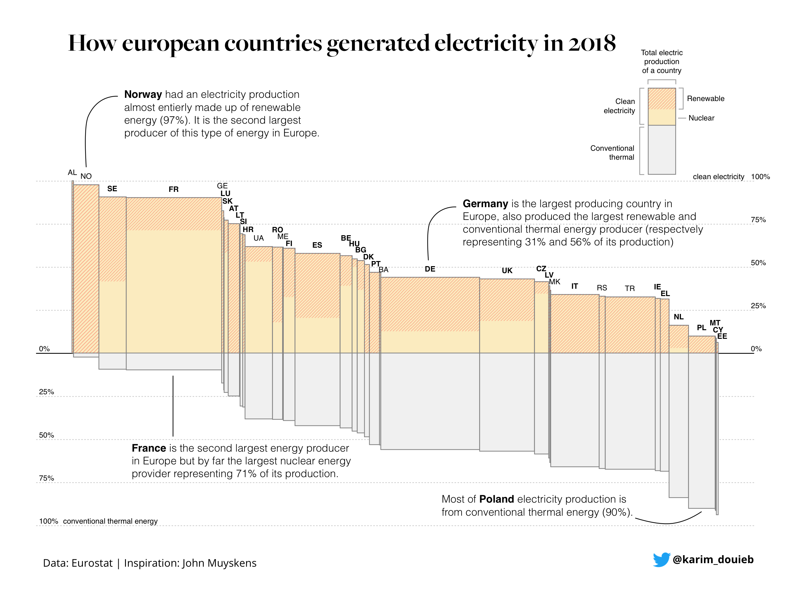

```{r setup, include=FALSE}
knitr::opts_chunk$set(echo = TRUE)
```

Back at it again. Had to miss last week due to work/school stuff so it's nice to be back. This week the \#tidytuesday dataset is on energy

## Fetching the data/setup

As always I begin by fetching the data from the tidytuesday repo. 
### Packages:
These are the package I plan on using today:

+ tidyverse (It's what this is all about)
+ ggtext (A wonderful package by [@ClausWilke](https://twitter.com/ClausWilke) that enables better control over text rendering)
+ patchwork (By the amazing [@thomasp85](https://twitter.com/thomasp85) allows for easy combining of plots)
+ janitor (makes it easy to clean the names of a data set.)
+ forcats (easy work with factors)
+ delabj (A personal package that includes a few tweaks to ggplot, and custom themes on github use devtools::install_github("delabj/delabj") to install) 

```{r loading, message=FALSE, warning=FALSE, echo=FALSE}
extrafont::loadfonts("win")
library(tidyverse)
library(ggtext)
library(patchwork)
library(janitor)
library(delabj)
library(wesanderson)
library(forcats)
library(vapoRwave)
library(ggCyberPunk)


energy_types <- readr::read_csv('https://raw.githubusercontent.com/rfordatascience/tidytuesday/master/data/2020/2020-08-04/energy_types.csv')
country_totals <- readr::read_csv('https://raw.githubusercontent.com/rfordatascience/tidytuesday/master/data/2020/2020-08-04/country_totals.csv')


#going to try this hack for making a process gif
dir.create(file.path(getwd(), "temp_plots"), showWarnings = FALSE)


save_plot_date <- function(folder = "temp_plots"){
  ggsave(here::here(paste0("/plot_",stringr::str_replace_all(Sys.time(),":|-| ","_"),".png")), height = 5, width = 10, type="cairo")
}
ggplot_print_replace <- function(x, ...) {
  #save_plot_date("temp_plots")
  ggplot2:::print.ggplot(x, ...)
}
#Replace ggplot print method
print.ggplot <- ggplot_print_replace


```


## EDA
Typically I do a lot of exploration to figure out what I want to do, but today I want to recreate this plot

  

It was made using D3, and I'm curious to see how hard it would be to make in ggplot2. I'm not a huge fan in general of charts that vary tile size across x and y since the area changes and it's hard to gauge, but there's something super compelling about this design. I think most of the data is in the energy types data set. I also have an idea for something I can do with the country totals data


```{r  EDA}
country_totals %T>% 
  glimpse() %>%
  summary()


energy_types %T>% 
  glimpse() %>%
  summary()
```


## Data Cleaning
The data looks mostly clean. So I'm going to think about the variables I need to have for recreation

I'll do this by thinking about the aesthetics T

- The geometry is going to be something like a stacked bar or a tile
- x is the total electric production of a country
- y is the % of the countries electricity 
  + this axis is a bit weird
  + it goes from 0-100% on the top for renewable energy+
  + and from 0-100% below for conventional. 
  + I think I can handle this by relabeling after mapping a set of negative values.
- fill is Energy Cleanliness: Clean energy vs conventional
  + Clean is split into renewable and nuclear
  + All others are conventional
- Total Electric production of a country

```{r cleaning and transforming}
energy_types$type %>% as.factor() %>% levels()
# Not sure if other was part of the conventional or not. 


  country_level <- energy_types %>%
  transmute(
    country_label = country,
    country = country_name, 
    energy_type = case_when(
      str_detect(type, "Conventional") ~ "Conventional Thermal",
      str_detect(type, "Nuclear")      ~ "Nuclear",
      TRUE                             ~ "Renewable Energy"
      ),
    country = if_else(country_label == "UK", "United Kingdom", country),
    energy_2018 = `2018`
    ) %>%
    group_by(country, country_label, energy_type) %>%
    summarise(energy_2018 = sum(energy_2018, na.rm = TRUE))  %>%
    ungroup() 
  
  
  country_totals <-   country_level %>%
    group_by(country_label, country) %>%
    summarise(total_energy_2018 = sum(energy_2018))
  
  
  
  
  recreation_df <- country_level %>% 
    left_join(country_totals) %>%
    mutate(pct_2018 = energy_2018/total_energy_2018, 
           pct_2018 = if_else(energy_type != "Conventional Thermal", pct_2018, -1*pct_2018))
  
  
  order_countries  <- recreation_df %>%
    filter(energy_type == "Conventional Thermal") %>%
    arrange(desc(pct_2018)) %>%
    transmute(
      country,
      country_label,
      order = row_number())
  
  recreation_df <- recreation_df %>% 
    left_join(order_countries) %>%
    mutate(country = fct_reorder(country,order))
  
  width <- recreation_df %>%
    arrange(country) %>%
    group_by(country) %>%
    summarise(total_energy_2018 = max(total_energy_2018))%>% 
    mutate(right =  cumsum(total_energy_2018)/sum(total_energy_2018)*length(order_countries$country), 
           left = lag(right, default = 0))
  
  positive_bar <- recreation_df %>% 
    filter(energy_type != "Conventional Thermal") %>%
    group_by(country) %>%
    mutate(top = cumsum(pct_2018),
           bottom = top-pct_2018) %>%
    ungroup()
  
  negative_bar <- recreation_df %>% 
    filter(energy_type == "Conventional Thermal") %>%
      mutate(top = pct_2018, 
             bottom = 0)%>%
    ungroup()
  
  height <- bind_rows(
    positive_bar, 
    negative_bar
      
    )
    
    
  recreation_df <- recreation_df %>%
    left_join(width) %>%
    left_join(height) %>%
    mutate(label_position = (right + left )/2)

```
Now lets make the chart. I think I'm going to have to do this with geom_tile, but lets see.

```{r}

  base_plot <- ggplot(recreation_df ,aes(xmin = right, xmax=left , ymin=bottom, ymax = top, fill = energy_type))+
  geom_rect(color = "black", size =.05)+
  ggrepel::geom_text_repel(data = recreation_df %>% filter(energy_type == "Renewable Energy"),
            aes(label = country_label, x =label_position, y =top+.05), 
            direction = "y", 
            segment.color = NA, 
            size = 2.5, 
            force = 0.01,
            hjust = 0.5, 
            vjust = 1)+
  geom_hline(aes(yintercept = 0), color = "black", size = .5)+
  labs(
    title = "How european countries generated electricity in 2018", 
    x = NULL, 
    y=NULL, 
    caption = "Data: Eurostat | Original by <b>@karim_douieb<b>"
  )+
  geom_curve(data = data.frame(x = 1.13723783964442,
    y = 1.81940055459049,
    xend = 0.691153605544002,
    yend = 1.26159196202926),
    mapping = aes(x = x,
    y = y,
    xend = xend,
    yend = yend),
    angle = 90L,
    colour = "black",
    curvature = 0.25,
    inherit.aes = FALSE,
    show.legend = FALSE)+
geom_richtext(data = data.frame(x = 1.40942679208399,
    y = 1.91387010985907,
    label = "<b>Norway</b> had an elecricity production<br>almost entierly made up of renewable<br>energy (97%). it is the     second largest<br>produccer of this type of energy in Europe"),
    mapping = aes(x = x,
    y = y,
    label = label),
    angle = 0L,
    lineheight = 1L,
    hjust = 0L,
    vjust = 1L,
    family = "Open Sans",
    size = 2.5,
    fontface = "plain",
    inherit.aes = FALSE,
    show.legend = FALSE,
     fill = NA, label.color = NA)+
  geom_curve(data = data.frame(x = 21.0835757358486,
    y = 1.2388242643737,
    xend = 20.1914072676478,
    yend = 0.692399520640256),
    mapping = aes(x = x,
    y = y,
    xend = xend,
    yend = yend),
    angle = 90L,
    colour = "black",
    curvature = 0.5,
    
    inherit.aes = FALSE,
    show.legend = FALSE)+
  geom_richtext(data = data.frame(x = 21.3384810124774,
    y = 1.38681429913485,
    label = "<b>Germany</b> is the largest producing country in<br>Europe, is also the largest renewable and<br>conventional thermal energy producer (respectively<br>representing 31% and 56% of     its production)"),
    mapping = aes(x = x,
    y = y,
    label = label),
    angle = 0L,
    lineheight = 1L,
    hjust = 0L,
    vjust = 1L,
    family = "Open Sans",
    size = 2.5,
    fontface = "plain",
    inherit.aes = FALSE,
    show.legend = FALSE,
     fill = NA, label.color = NA)+
  geom_curve(data = data.frame(x = 30.5787972902717,
    y = -0.889955466421189,
    xend = 35.9955344186339,
    yend = -0.924107012904529),
    mapping = aes(x = x,
    y = y,
    xend = xend,
    yend = yend),
    angle = 90L,
    colour = "black",
    curvature = 0.12,
    inherit.aes = FALSE,
    show.legend = FALSE)+
  geom_richtext(data = data.frame(x = 19.9569462238508,
    y = -0.755539654552852,
    label = "Most of <b>Poland's</b> electricity production is<br>from conventional thermal energy (90%)"),
    mapping = aes(x = x,
    y = y,
    label = label),
    angle = 0L,
    lineheight = 1L,
    hjust = 0L,
    vjust = 1L,
    family = "Open Sans",
    size = 2.5,
    fontface = "plain",
    inherit.aes = FALSE,
    show.legend = FALSE,
     fill = NA, label.color = NA)+
  geom_curve(data = data.frame(x = 5.49248727589215,
    y = -0.60,
    xend = 5.49248727589215,
    yend = -0.172772990271038),
    mapping = aes(x = x,
    y = y,
    xend = xend,
    yend = yend),
    angle = 0L,
    colour = "black",
    curvature = 0.01,
    inherit.aes = FALSE,
    show.legend = FALSE)+
  geom_richtext(data = data.frame(x = 2.47549054194566,
    y = -0.55,
    label = "<b>France</b> is the second largest energy producer<br>in Europe but by far the largest nuclear energy<br>provider representing 71% of its prodiction."),
    mapping = aes(x = x,
    y = y,
    label = label),
    angle = 0L,
    lineheight = 1L,
    hjust = 0L,
    vjust = 1L,
    family = "Open Sans",
    size = 2.5,
    fontface = "plain",
    inherit.aes = FALSE,
    show.legend = FALSE,
     fill = NA, label.color = NA)+
  geom_richtext(data = data.frame(x = 34.6572817163327,
    y = 1.15,
    label = "clean energy"),
    mapping = aes(x = x,
    y = y,
    label = label),
    angle = 0L,
    lineheight = 1L,
    hjust = 0L,
    vjust = 1L,
    family = "Open Sans",
    color = "grey30",
    size = 2.5,
    fontface = "plain",
    inherit.aes = FALSE,
    show.legend = FALSE,
     fill = NA, label.color = NA)+
  geom_text(data = data.frame(x = -0.264741181814027,
    y = -.95,
    label = "conventional themal energy"),
    mapping = aes(x = x,
    y = y,
    label = label),
    angle = 0L,
    lineheight = 1L,
    hjust = 0L,
    vjust = 1L,
    family = "Open Sans",
    color = "grey30",
    size = 2.5,
    fontface = "plain",
    inherit.aes = FALSE,
    show.legend = FALSE,
     fill = NA, label.color = NA)+
  theme_minimal(base_family = "Open Sans")+
  scale_x_discrete()+
  legend_bottom()+
  expand_limits(y=2.25)+
  scale_fill_manual(values = c("#F0F0F0", "#FBEBBF", "#FCA183"))+
  scale_y_continuous( 
    breaks = c( 1,  0.75,   0.5,  0.25,    0, -0.25,  -0.5, -0.75,     -1), 
    labels = c("",    "",    "",    "", "0%", "25%", "50%", "75%", "100%"),
    sec.axis = sec_axis(
      ~. *1, name = "", 
      breaks = c(     1,  0.75,   0.5,  0.25,   0 ),
      labels = c("100%", "75%", "50%", "25%", "0%")
    ))+
  theme(
    plot.caption.position = "plot",
    plot.title = element_text(family = "DM Serif Display", size = 18),
    panel.grid.major.y  = element_line(linetype = "dashed", color = "#d6d6d6"),
    panel.grid.minor    = element_blank(), 
    plot.caption = element_markdown(hjust = 0), 
    axis.text = element_text(vjust = 0, color = "grey30", size = 8)
  )
```

```{r}
#guide plotting

inset <- ggplot(recreation_df)+
  geom_rect(aes(xmin=0, xmax = 2,
               ymin= 0, ymax = 1), fill = "#FBEBBF", color = "black", size = 0.5 )+
   geom_rect(aes(xmin=0, xmax = 2,
               ymin= 1, ymax = 2), fill = "#FCA183", color = "black", size = 0.5 )+
  geom_rect(aes(xmin=0, xmax = 2,
               ymin= 0, ymax = -2), fill = "#F0F0F0", color = "black", size = 0.5 )+
  geom_segment(aes(x=-.25, xend=-.25, y=2-0.062, yend= 0.0625), color = "black")+
  geom_segment(aes(x=-.25, xend=-.125, y=2-0.062, yend=2-0.062), color = "black")+
  geom_segment(aes(x=-.25, xend=-.125, y= 0.0625, yend= 0.0625), color = "black")+
  # geom_richtext(aes(x=-.375, y = 1), label = "Clean<br>electricity", 
  #               family = "Open Sans", hjust =1,
  #               fill = NA, label.color = NA , size = 2.5)+
  geom_segment(aes(x=-.25, xend=-.25,  y= -2+0.0625, yend=- 0.0625), color = "black")+
  geom_segment(aes(x=-.25, xend=-.125, y= -2+0.0625, yend=-2+0.0625),       color = "black")+
  geom_segment(aes(x=-.25, xend=-.125, y= -0.0625,   yend=- 0.0625),        color = "black")+
  # geom_richtext(aes(x=-.375, y = -1), label = "Conventional<br>thermal", 
  #               family = "Open Sans", hjust =1,
  #               fill = NA, label.color = NA  , size = 2.5)+
  geom_segment(aes(x=2.25, xend=2.25, y=2-0.062, yend= 1.0625), color = "black")+
  geom_segment(aes(x=2.25, xend=2.125, y=2-0.062, yend=2-0.062), color = "black")+
  geom_segment(aes(x=2.25, xend=2.125, y= 1.0625, yend= 1.0625), color = "black")+
  # geom_richtext(aes(x=2.375, y = 1.5), label = "Renewable", 
  #               family = "Open Sans", hjust =0,
  #               fill = NA, label.color = NA  , size = 2.5)+
geom_segment(aes(x=2.25, xend=2.25, y=1-0.062, yend= 0.0625), color = "black")+
  geom_segment(aes(x=2.25, xend=2.125, y=1-0.062, yend=1-0.062), color = "black")+
  geom_segment(aes(x=2.25, xend=2.125, y= 0.0625, yend= 0.0625), color = "black")+
  # geom_richtext(aes(x=2.375, y = .5), label = "Nuclear", 
  #               family = "Open Sans", hjust =0,
  #               fill = NA, label.color = NA  , size = 2.5)+
  geom_segment(aes(x=0.0625, xend = 2-0.0625, y = 2.25, yend=2.25))+
  geom_segment(aes(x=0.0625, xend = 0.0625, y = 2.125, yend=2.25))+
  geom_segment(aes(x=2-0.0625, xend = 2-0.0625, y = 2.125, yend=2.25))+
  # geom_richtext(aes(x=1,y=2.375 ), hjust = .5, label = "Total electric<br>produuction<br>of a country",
  #               family = "Open Sans",  vjust = 0,
  #               fill = NA, label.color = NA  , size = 2.5) +
  theme_void()+
  expand_limits(x= c(-1.25,3.25), y = 3)


```

```{r}
base_plot+legend_none()+cowplot::draw_plot(inset, 32, 1.125, 5,1)+
  geom_richtext(aes(x=34.5,y=1.95), hjust = .5, label = "Total electric<br>production<br>of a country",
                family = "Open Sans",  vjust = 0,
                fill = NA, label.color = NA  , size = 2) 
 
```


```{r}

  ggsave(paste0(getwd(),"/temp_plots/",stringr::str_replace_all(Sys.time(),":|-| ","_"),".png"), device = "png", height = 5, width = 10, type = "cairo")

```


