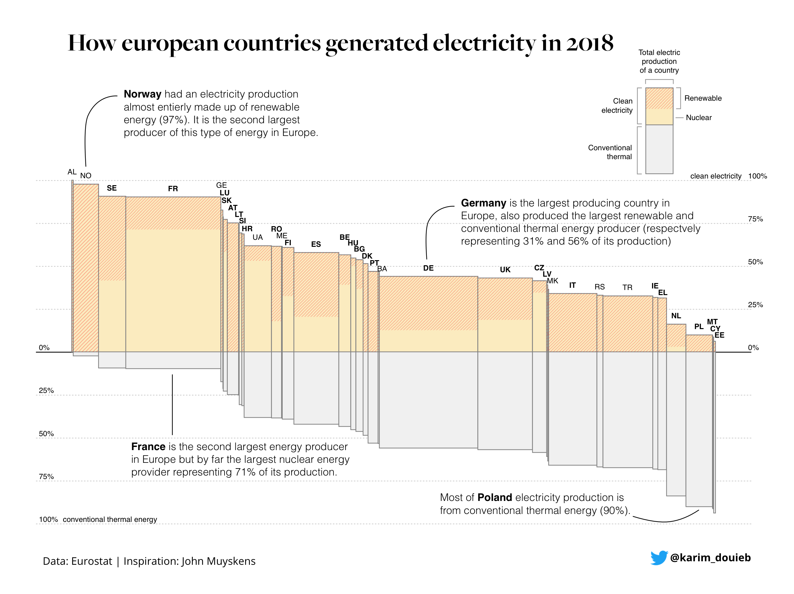
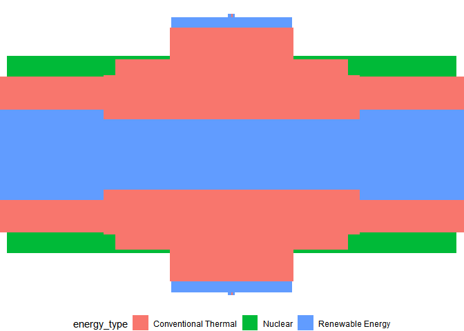

Energy in Europe
================

Back at it again. Had to miss last week due to work/school stuff so it’s
nice to be back. This week the \#tidytuesday dataset is on energy

## Fetching the data/setup

As always I begin by fetching the data from the tidytuesday repo. \#\#\#
Packages: These are the package I plan on using today:

  - tidyverse (It’s what this is all about)
  - ggtext (A wonderful package by
    \[@ClausWilke\](<https://twitter.com/ClausWilke>) that enables
    better control over text rendering)
  - patchwork (By the amazing
    \[@thomasp85\](<https://twitter.com/thomasp85>) allows for easy
    combining of plots)
  - janitor (makes it easy to clean the names of a data set.)
  - forcats (easy work with factors)
  - delabj (A personal package that includes a few tweaks to ggplot, and
    custom themes on github use
    devtools::install\_github(“delabj/delabj”) to install)

## EDA

Typically I do a lot of exploration to figure out what I want to do, but
today I want to recreate this plot



It was made using D3, and I’m curious to see how hard it would be to
make in ggplot2. I’m not a huge fan in general of charts that vary tile
size across x and y since the area changes and it’s hard to gauge, but
there’s something super compelling about this design. I think most of
the data is in the energy types data set. I also have an idea for
something I can do with the country totals data

``` r
country_totals %T>% 
  glimpse() %>%
  summary()
```

    ## Rows: 185
    ## Columns: 7
    ## $ country      <chr> "BE", "BE", "BE", "BE", "BE", "BG", "BG", "BG", "BG", ...
    ## $ country_name <chr> "Belgium", "Belgium", "Belgium", "Belgium", "Belgium",...
    ## $ type         <chr> "Total net production", "Imports", "Exports", "Energy ...
    ## $ level        <chr> "Total", "Total", "Total", "Total", "Total", "Total", ...
    ## $ `2016`       <dbl> 82520.000, 14648.000, 8465.000, 1475.000, 87228.000, 4...
    ## $ `2017`       <dbl> 82948.500, 14189.400, 8167.800, 1485.400, 87484.700, 4...
    ## $ `2018`       <dbl> 69212.347, 21635.908, 4308.347, 1347.901, 85192.007, 4...

    ##    country          country_name           type              level          
    ##  Length:185         Length:185         Length:185         Length:185        
    ##  Class :character   Class :character   Class :character   Class :character  
    ##  Mode  :character   Mode  :character   Mode  :character   Mode  :character  
    ##                                                                             
    ##                                                                             
    ##                                                                             
    ##                                                                             
    ##       2016             2017             2018       
    ##  Min.   :     0   Min.   :     0   Min.   :     0  
    ##  1st Qu.:  1620   1st Qu.:  2205   1st Qu.:  2187  
    ##  Median :  8426   Median :  8190   Median :  8326  
    ##  Mean   : 45207   Mean   : 45413   Mean   : 45062  
    ##  3rd Qu.: 29583   3rd Qu.: 30676   3rd Qu.: 31671  
    ##  Max.   :614155   Max.   :619059   Max.   :571800  
    ##  NA's   :1

``` r
energy_types %T>% 
  glimpse() %>%
  summary()
```

    ## Rows: 296
    ## Columns: 7
    ## $ country      <chr> "BE", "BE", "BE", "BE", "BE", "BE", "BE", "BE", "BG", ...
    ## $ country_name <chr> "Belgium", "Belgium", "Belgium", "Belgium", "Belgium",...
    ## $ type         <chr> "Conventional thermal", "Nuclear", "Hydro", "Pumped hy...
    ## $ level        <chr> "Level 1", "Level 1", "Level 1", "Level 2", "Level 1",...
    ## $ `2016`       <dbl> 30728.00, 41430.00, 1476.00, 1110.00, 5340.00, 3070.00...
    ## $ `2017`       <dbl> 31316.000, 40128.500, 1360.900, 1093.200, 6387.900, 32...
    ## $ `2018`       <dbl> 30092.635, 26995.628, 1239.248, 983.190, 7177.346, 348...

    ##    country          country_name           type              level          
    ##  Length:296         Length:296         Length:296         Length:296        
    ##  Class :character   Class :character   Class :character   Class :character  
    ##  Mode  :character   Mode  :character   Mode  :character   Mode  :character  
    ##                                                                             
    ##                                                                             
    ##                                                                             
    ##       2016               2017               2018         
    ##  Min.   :     0.0   Min.   :     0.0   Min.   :     0.0  
    ##  1st Qu.:     0.0   1st Qu.:     0.0   1st Qu.:     0.0  
    ##  Median :   373.3   Median :   351.9   Median :   278.4  
    ##  Mean   : 12783.4   Mean   : 12911.0   Mean   : 12796.2  
    ##  3rd Qu.:  5677.2   3rd Qu.:  5924.5   3rd Qu.:  6790.1  
    ##  Max.   :390141.0   Max.   :379094.0   Max.   :393153.3

## Data Cleaning

The data looks mostly clean. So I’m going to think about the variables I
need to have for recreation

I’ll do this by thinking about the aesthetics T

  - The geometry is going to be something like a stacked bar or a tile
  - x is the total electric production of a country
  - y is the % of the countries electricity
      - this axis is a bit weird
      - it goes from 0-100% on the top for renewable energy+
      - and from 0-100% below for conventional.
      - I think I can handle this by relabeling after mapping a set of
        negative values.
  - fill is Energy Cleanliness: Clean energy vs conventional
      - Clean is split into renewable and nuclear
      - All others are conventional
  - Total Electric production of a country

<!-- end list -->

``` r
energy_types$type %>% as.factor() %>% levels()
```

    ## [1] "Conventional thermal" "Geothermal"           "Hydro"               
    ## [4] "Nuclear"              "Other"                "Pumped hydro power"  
    ## [7] "Solar"                "Wind"

``` r
# Not sure if other was part of the conventional or not. 


  country_level <- energy_types %>%
  transmute(
    country_label = country,
    country = country_name, 
    energy_type = case_when(
      str_detect(type, "Conventional") ~ "Conventional Thermal",
      str_detect(type, "Nuclear")      ~ "Nuclear",
      TRUE                             ~ "Renewable Energy"
      ),
    energy_2018 = `2018`
    ) %>%
    group_by(country, country_label, energy_type) %>%
    summarise(energy_2018 = sum(energy_2018, na.rm = TRUE))  %>%
    ungroup() 
```

    ## `summarise()` regrouping output by 'country', 'country_label' (override with `.groups` argument)

``` r
  country_totals <-   country_level %>%
    group_by(country_label, country) %>%
    summarise(total_energy_2018 = sum(energy_2018))
```

    ## `summarise()` regrouping output by 'country_label' (override with `.groups` argument)

``` r
  recreation_df <- country_level %>% 
    left_join(country_totals) %>%
    mutate(pct_2018 = energy_2018/total_energy_2018)
```

    ## Joining, by = c("country", "country_label")

Now lets make the chart. I think I’m going to have to do this with
geom\_tile, but lets see.

``` r
recreation_df %>%
  ggplot(aes(x= as.factor(country), y=0, height = pct_2018, width = total_energy_2018,  fill = energy_type))+
  geom_tile()+
  theme_void()+
  scale_x_discrete()+
  legend_bottom()
```

<!-- -->
